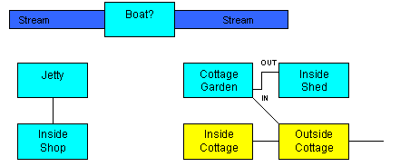

::: topbar
[{border="0"}](index.html)
:::

::: main
[\[Main\]](index.html)\
*[\[Previous\]](callingaspadeaspade.htm)   [\[Next\]](rowmyboat.htm)*

# Chapter 7 - Pushing the Boat Out

## Let There be Light

This is the last chapter in which we\'ll try to make things more
difficult for poor Heidi. The complication we\'ll add is quite simple:
simply change the class of insideCave from Room to DarkRoom. As you\'ll
find if you now try to pay the cave a visit, Heidi now needs a light
source to see what\'s going on there. The next task, then, is to plant a
torch (which American readers may call a flashlight) somewhere. We
can\'t put it inside the cottage, since that would make the game
unwinnable (you need to dig up the boots to get to the key to get into
the cottage). So instead we\'ll put the torch/flashlight in a garden
shed. We\'ll also be creating a stream, a jetty, and a shop that Heidi
will eventually need to visit in order to buy some batteries for the
torch/flashlight.\

  ----------------------------------- -----------------------------------
                                       \

  ----------------------------------- -----------------------------------

  -- --
     
  -- --

Again, before seeing how this guide tackles all this, you might like to
have a go at adding some of this for yourself. First of all, you need to
add four more locations to the map: the garden, the inside of the shed,
the jetty, and the shop, bearing in mind that the player may want to use
the commands **enter shed** and **enter shop** as an alternative to
other movement commands:\
\

  ----------------------------------- -----------------------------------
                                      {width="452"
                                      height="184" border="0"} \

  ----------------------------------- -----------------------------------

  -- --
     
  -- --

\
\
You\'ll also need to put a pair of oars and a torch (without batteries)
inside the shed, perhaps placing the latter in a cupboard. There\'ll
need to be an object representing the stream at both locations, and a
customised response to **cross stream** explaining why Heidi can\'t
simply cross it at that point. It would be especially neat if the player
got the same response from a **north** command issued by the stream. You
might also want to add some FakeConnectors or NoTravelMessages to
explain why Heidi can\'t go west from the Garden or either east or west
from the Jetty.\
\
Your biggest challenge, however, will be to get Heidi from the Cottage
Garden to the Jetty, since the map shows no direct connection. The idea
is that Heidi gets there by rowing a boat down the stream (hence the
oars), so you\'ll need a boat that Heidi can enter, a means of moving it
between the Garden and the Jetty (and back), and a new **row** verb,
which will require Heidi to be sitting in the boat holding the oars
before it all works. Maybe the boat will need more than one object, such
as an inside boat room that Heidi actually enters and a boat object to
represent the boat from outside, just as you may create a shed object to
represent the shed from outside.\
\
If you can\'t manage all this by yourself, not to worry; once you\'ve
got as far as you can get, you can read on to see at least one way this
can all be implemented.\

  ----------------------------------- -----------------------------------
                                       \

  ----------------------------------- -----------------------------------

  -- --
     
  -- --

First, then, we need to create the garden and its shed, using the
opportunity to introduce a few more TADS 3 features we haven\'t come
across yet:\

  ----------------------------------- -----------------------------------
                                       \

  ----------------------------------- -----------------------------------

  -- --
     
  -- --

cottageGarden : OutdoorRoom \'Cottage Garden\'\
  \"This neat little garden is situated on the north side of the cottage. A\
  stream runs along the bottom of the garden, while a short path disappears\
  through a gap in the fence to the southeast, and another leads westwards \
  down to the road. Next to the fence stands a small garden shed. \"  \
  southeast = outsideCottage\
  north : NoTravelMessage {\"\<\<gardenStream.cannotCrossMsg\>\>\"}\
  east : NoTravelMessage {\"You can\'t walk through the fence. \"}\
  west : FakeConnector {\"That path leads down to the road, and you don\'t \
    fancy going near all those nasty, smelly, noisy cars right now. \" }\
  in = insideShed  \
;\
\
+ Decoration \'wooden fence\' \'wooden fence\'\
  \"The tall wooden fence runs along the eastern side of the garden, with\
   a small gap at its southern end. \"\
;\
\
+ gardenStream: Fixture \'stream\' \'stream\'\
  \"\<\<cannotCrossMsg\>\>\"\
  dobjFor(Cross)\
  {\
    verify() {}\
    check() { failCheck(cannotCrossMsg); }\
  }\
  cannotCrossMsg = \' The stream is quite wide at \
    this point, and too deep to cross. \'\
;\
\
+ Enterable -\> insideShed \'garden shed\' \'garden shed\'  \
  \"It\'s a small, wooden shed. \"  \
  matchNameCommon(origTokens, adjustedTokens)\
  {\
    if(adjustedTokens.indexOf(\'shed\'))\
      return self;\
    else\
      return cottageGarden;\
  }\
;\
\
insideShed : Room \'Inside the Garden Shed\'\
 \"The inside of the shed is full of garden implements, leaving just about\
  enough room for one person to stand. An old cupboard stands \
  in the corner. \"\
 out = cottageGarden\
;\
\
+ Decoration \'garden implements/hoe/rake/shears\' \'garden implements\'\
  \"There\'s a hoe, a rake, some shears, and several other bits and pieces. \"\
  isPlural = true\
;\
\
+ oars : Thing \'pair/oars\' \'pair of oars\'\
  \"The oars look like they\'re meant for a small rowing-boat. \"\
  bulk = 10\
  initSpecialDesc = \"A pair of oars leans against the wall. \"\
;\

  ----------------------------------- -----------------------------------
                                       \

  ----------------------------------- -----------------------------------

  -- --
     
  -- --

To take the simple points first, we add isPlural = true to the
definition of the Decoration object so that an attempt to take, say, the
hoe results in \"The garden implements aren\'t important\" rather than
\"The garden implements isn\'t important.\" The other simple point is
that the -\>insideShed on the Enterable object is a shorthand way of
specifying its connector property (through use of a template).\

  ----------------------------------- -----------------------------------
                                       \

  ----------------------------------- -----------------------------------

  -- --
     
  -- --

The more complex point involves the garden shed. Since it\'s called
\'garden shed\', the player could in principle refer to it either as
\'shed\', \'garden shed\' or just \'garden\', and all three forms would
match. Yet one may feel that the last of these forms *shouldn\'t* match.
The player character is standing in a garden, so logically the command
**x garden** should result in a description of the garden, not the
shed.\
\
The matchNameCommon method is the way we get round this. To quote from
the comments in the library source code:\

  ----------------------------------- -----------------------------------
                                       \

  ----------------------------------- -----------------------------------

  -- --
     
  -- --

  ----------------------- ----------------------- -----------------------
                          \'origTokens\' is the   
                          list of the original    
                          input words making up   
                          the noun phrase, in     
                          canonical tokenizer     
                          format. Each element of 
                          this list is a sublist  
                          representing one token. 
                           \                      

  ----------------------- ----------------------- -----------------------

  ----------------------- ----------------------- -----------------------
                           \                      

  ----------------------- ----------------------- -----------------------

  ----------------------- ----------------------- -----------------------
                          \'adjustedTokens\' is   
                          the \"adjusted\" token  
                          list, which provides    
                          more information on how 
                          the parser is analyzing 
                          the phrase but may not  
                          contain the exact       
                          original tokens of the  
                          command. In the         
                          adjusted list, the      
                          tokens are represented  
                          by pairs of values in   
                          the list: the first     
                          value of each pair is a 
                          string giving the       
                          adjusted token text,    
                          and the second value of 
                          the pair is a property  
                          ID giving the part of   
                          speech of the parser\'s 
                          interpretation of the   
                          phrase. For example, if 
                          the noun phrase is      
                          \"red book\", the list  
                          might look like         
                          \[\'red\', &adjective,  
                          \'book\', &noun\].  \   

  ----------------------- ----------------------- -----------------------

  -- -- -- --
           
  -- -- -- --

  ----------------------------------- -----------------------------------
                                       \

  ----------------------------------- -----------------------------------

  -- --
     
  -- --

For our purposes all we need to know is that adjustedTokens will be a
list that will include all the tokens the player typed, so we can test
whether or not \'shed\' is among them. If not, the player must have
typed \'garden\' but not \'shed\'. Since adjustedTokens is a list, we
can use its indexOf method to find where in the list the string \'shed\'
is; if \'shed\' is in the list then adjustedTokens.indexOf(\'shed\')
will return a non-zero number which the test (with if) will treat as
true; if it isn\'t then the test will fail. If the test succeeds, the
tokens include \'shed\' and we return self (i.e. the shed) as the object
matched. Otherwise the player typed \'garden\' but not shed, so we
return cottageGarden as the object matched. Thus, if the player types
**x garden shed** or **x shed** the game will describe the shed, but if
he or she types **x garden** it will describe the garden.\
\
We could have implemented some of this functionality by using a *weak
token* in the definition of the garden shed; we\'d do this by enclosing
the word \'garden\' in parentheses in the list of vocabulary words,
i.e.:\

  ----------------------------------- -----------------------------------
                                       \

  ----------------------------------- -----------------------------------

  -- --
     
  -- --

+ Enterable -\> insideShed \'(garden) shed\' \'garden shed\'\
\
This would prevent the garden shed from responding to commands that just
use the word \'garden\' but would not remap such commands to the garden
object. This, however, could easily be achieved by adding a
vocabWords property to the definition of the cottage garden thus:-\

  ----------------------------------- -----------------------------------
                                       \

  ----------------------------------- -----------------------------------

  ----------------------------------- -------------------------------------
                                      vocabWords = \'(cottage) garden\' \

  ----------------------------------- -------------------------------------

  ----------------------------------- -----------------------------------
                                       \

  ----------------------------------- -----------------------------------

  -- --
     
  -- --

Note that once again we can use the weak token feature, so that the
garden can be referred to by **x garden** or **x cottage garden** but
not simply **x cottage** (you might want to add a cottage decoration
object to respond to the latter). In practice one would probably use the
weak tokens method rather than defining a custom matchNameCommon method
to achieve the result desired here, but the detour through
matchNameCommon has illustrated how to use it.\
\
There\'s a couple more things we may want to do with the Enterable
representing the outside of this garden shed. If the player types **open
shed** or **look in shed**, the standard library responses may be not
just unhelpful but potentially misleading (perhaps suggesting that the
shed is only a decoration object):\

  ----------------------------------- -----------------------------------
                                       \

  ----------------------------------- -----------------------------------

  ----------------------------------- -----------------------------------
                                      \>**open shed** \

  ----------------------------------- -----------------------------------

  ----------------------------------- -----------------------------------
                                      That is not something you can open.
                                       \

  ----------------------------------- -----------------------------------

  ----------------------------------- -----------------------------------
                                       \

  ----------------------------------- -----------------------------------

  ----------------------------------- -----------------------------------
                                      \>**look in shed** \

  ----------------------------------- -----------------------------------

  ----------------------------------- -----------------------------------
                                      There\'s nothing unusual in the
                                      garden shed. \

  ----------------------------------- -----------------------------------

  ----------------------------------- -----------------------------------
                                       \

  ----------------------------------- -----------------------------------

  -- --
     
  -- --

We can solve the first problem simply by making the shed an Openable as
well as an Enterable. The second is perhaps most easily solved by having
**look in shed** treated as **enter shed**, on the grounds that someone
wanting to find out what\'s in the shed would go inside it. A final
problem is that if the player examines the shed it will be described as
a \'small wooden shed\', but that, as things stand, **x small wooden
shed** will provoke the response, \'You see no small wooden shed here\';
we need to add \'small\' and \'wooden\' to the vocabWords of this
object. Our revised shed exterior thus becomes:\

  ----------------------------------- -----------------------------------
                                       \

  ----------------------------------- -----------------------------------

  -- --
     
  -- --

+ Openable, Enterable -\> insideShed \'small wooden (garden) shed\' \
  \'garden shed\'   \
  \"It\'s a small, wooden shed. \"  \
  dobjFor(LookIn) asDobjFor(Enter)\
;\

  ----------------------------------- -----------------------------------
                                       \

  ----------------------------------- -----------------------------------

  -- --
     
  -- --

You may have noticed that the description of the shed\'s interior
includes mention of an old cupboard. What we want to do next is to put a
tin on the cupboard and a torch inside it. On the face of it we can\'t
do this, since an object can be either a container (something you can
put things in) or a surface (something you put things on) but not both
at the same time. We could get round this by laboriously making our
cupboard out of separate objects, but fortunately the TADS 3 library has
already done most of this work for us with a class called
ComplexContainer. For the details of how ComplexContainer works, you can
consult the *Library Reference Manual* and the *TADS 3 Tour Guide* but
there\'s no need to do so right now; the implementation of our cupboard
using this class becomes quite straightforward:\

  ----------------------------------- -----------------------------------
                                       \

  ----------------------------------- -----------------------------------

  -- --
     
  -- --

+ cupboard: ComplexContainer, Heavy \'battered old wooden cupboard\' \
  \'old cupboard\'\
  \"The cupboard is a battered old wooden thing, with chipped blue and\
   white paint. \"\
   subContainer : ComplexComponent, OpenableContainer { }\
   subSurface : ComplexComponent, Surface { }\
;\

  ----------------------------------- -----------------------------------
                                       \

  ----------------------------------- -----------------------------------

  -- --
     
  -- --

Basically, the ComplexContainer delegates putting-in and putting-on type
behaviour to the anonymous nested objects defined in its subContainer
and subSurface properties. These nested objects must be of class
ComplexComponent, but you can then mix-in whatever classed you want
(which, logically, will normally be something like Container and Surface
respectively). The empty braces {} then contain the space where we\'d
define any properties or methods of these nested objects; but here we
don\'t need to, since all the relevant behaviour has already been
defined on their superclasses.\
\
The next task is to put objects in and on the cupboard:\

  ----------------------------------- -----------------------------------
                                       \

  ----------------------------------- -----------------------------------

  -- --
     
  -- --

++ tin : OpenableContainer \'small square tin\' \'small tin\'   \
  \"It\'s a small square tin with a lid. \"\
  subLocation = &subSurface\
  bulkCapacity = 5\
;\
\
+++ battery : Thing \'small red battery\' \'small red battery\'\
  \"It\'s a small red battery, 1.5v, manufactured by ElectroLeax\
  and made in the People\'s Republic of Erewhon. \"\
  bulk = 1\
;\
\
++ torch : Flashlight, OpenableContainer \'small blue torch/flashlight\'\
   \'small blue torch\'\
  \"It\'s just a small blue torch. \"\
  subLocation = &subContainer\
  bulkCapacity = 1\
;\

  ----------------------------------- -----------------------------------
                                       \

  ----------------------------------- -----------------------------------

  -- --
     
  -- --

The main thing to note here is the special syntax for specifying the
initial location of objects inside a ComplexContainer. We can still use
the + syntax to show that an object is on or in (or under or behind) a
ComplexContainer, but we need to specify which subobject of the
ComplexContainer the object is actually located in. To do this we use
the special subLocation property which can be used *only* for
initialization. If we subsquently wanted to move an object into a part
of a ComplexContainer we\'d need to do so with an explicit moveInto,
e.g. torch.moveInto(cupboard.subContainer). Note also that what we
assign to `subLocation` must be a property *pointer* (a property name
preceded by &).\
\
We make the torch an OpenableContainer so that we can insert the
battery. The behaviour of the torch requires a little thought. By
default an object of the Flashlight class will provide light if it\'s
switched on and will stop doing so if it\'s switched off. This is what
we want, with the added complication that it should only be possible to
turn the torch on if the battery is in it. A further complication is
that if the player insists on removing the battery while the torch is
on, it should at once go out again. Here\'s the definition of the torch
with all that extra handling added:\

  ----------------------------------- -----------------------------------
                                       \

  ----------------------------------- -----------------------------------

  -- --
     
  -- --

++ torch : Flashlight, OpenableContainer \'small blue torch/flashlight\' \'small blue torch\'\
  \"It\'s just a small blue torch. \"\
  subLocation = &subContainer\
  bulkCapacity = 1  \
  dobjFor(TurnOn)\
  {\
    check()\
    {\
      if(! battery.isIn(self))\
      {\
        \"Nothing happens. \";\
        exit;\
      }\
    }\
  }\
  iobjFor(PutIn)\
  {\
    check()\
    {\
      if(gDobj != battery)\
      {\
        \"{The dobj/he} doesn\'t fit in the torch. \";\
        exit;\
      }\
    }\
    action()\
    {      \
      inherited;\
      makeOpen(nil);\
      achieve.addToScoreOnce(1);\
    }\
  }\
  notifyRemove(obj)\
  {    \
    if(isOn)\
    { \
      \"Removing the battery causes the torch to go out. \";\
      makeOn(nil);        \
    }    \
  }\
  achieve: Achievement\
    { desc = \"fitting the battery into the torch\"  }\
;\

  ----------------------------------- -----------------------------------
                                       \

  ----------------------------------- -----------------------------------

  -- --
     
  -- --

There\'s nothing very difficult here, but note that we take the
opportunity to make sure that the battery is the only object that can be
put in the torch; we automatically close the torch after the battery is
inserted to avoid getting the battery mentioned in response to an
**inventory** command when we\'re carrying the torch. The most important
thing to note is the use of the notifyRemove method to handle the
battery being removed from the torch; we use this since we can\'t be
sure which command a player might use to do this, e.g. **take battery**
or **remove battery from torch**. The other thing we do is to award a
point for inserting the battery into the torch for the first time only.
To do this we define an Achievement object nested on the (custom)
achieve property, and call its addToScoreOnce(points) method in our
iObjFor(PutIn) action method. We do it this way since there is no
freestanding AddToScoreOnce *function* we can call, and we need the
Achievement object so that it can keep track of whether its been used to
award points before.\
\
At this point, we need to adjust the original location, first to
indicate that there\'s a path round to the side of the cottage, and
second to provide the relevant connection:\

  ----------------------------------- -----------------------------------
                                       \

  ----------------------------------- -----------------------------------

  ----------------------------------- -------------------------------------------------------------
                                      outsideCottage : OutdoorRoom \'In front of a cottage\'    \

  ----------------------------------- -------------------------------------------------------------

  ----------------------------------- ---------------------------------------------------------------------
                                         \"You stand just outside a cottage; the forest stretches east. \

  ----------------------------------- ---------------------------------------------------------------------

  ----------------------------------- -----------------------------------------------------------------------------
                                         A short path leads round the cottage to the northwest. \" *//add this* \

  ----------------------------------- -----------------------------------------------------------------------------

  ----------------------------------- -----------------------------------
                                         east = forest \

  ----------------------------------- -----------------------------------

  ----------------------------------- -----------------------------------
                                         in = cottageDoor \

  ----------------------------------- -----------------------------------

  ----------------------------------- -----------------------------------
                                         west asExit(in) \

  ----------------------------------- -----------------------------------

  ----------------------------------- ----------------------------------------------
                                         northwest = cottageGarden *// add this* \

  ----------------------------------- ----------------------------------------------

  ----------------------------------- -----------------------------------
                                      ; \

  ----------------------------------- -----------------------------------

  ----------------------------------- -----------------------------------
                                       \

  ----------------------------------- -----------------------------------

  ----------------------------------- -----------------------------------
                                      Once again, you can now recompile
                                      the program and test it all out to
                                      check that it still works. \

  ----------------------------------- -----------------------------------

  ----------------------------------- -----------------------------------
                                       \

  ----------------------------------- -----------------------------------

  -- --
     
  -- --

\

------------------------------------------------------------------------

*Getting Started in TADS 3*\
[\[Main\]](index.html)\
*[\[Previous\]](callingaspadeaspade.htm)   [\[Next\]](rowmyboat.htm)*
:::
