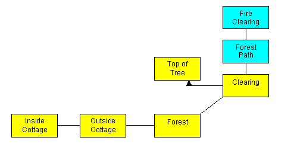

::: topbar
[{border="0"}](index.html)
:::

::: main
[\[Main\]](index.html)\
*[\[Previous\]](otherresponsestoactions.htm)
  [\[Next\]](abasicburner.htm)*

# Chapter 5 - Character Building

## Setting the Scene

The main task in this chapter will be to add an NPC (Non-Player
Character) to our game, though in the course of doing so we shall be
looking at a number of other matters. The first task is to add another
couple of locations to give our NPC somewhere to operate. He\'s going to
be a charcoal-burner working in the forest; clearly, then, he needs a
fire to tend, which we\'d better put in another clearing. In order to
avoid having one clearing running straight into another, we\'ll put a
length of path in between.\
\
Once again, you might like to have a go at implementing all this
yourself before turning the page and seeing how this guide does it.
First of all you need to add a \'forest path\' room north of the
clearing, and a \'fire clearing\' room north of the forest path,
remembering to add all the appropriate connections. The game map should
then look like this, with the new rooms you\'re adding shown in pale
blue:\

  ----------------------------------- -----------------------------------
                                       \

  ----------------------------------- -----------------------------------

  ----------------------------------- -----------------------------------
                                      {width="489"
                                      height="248" border="0"} \

  ----------------------------------- -----------------------------------

  ----------------------------------- -----------------------------------
                                       \

  ----------------------------------- -----------------------------------

  -- --
     
  -- --

\
There\'s no need to put any objects in the Forest Path, but in the Fire
Clearing we\'ll want a fire, and also the smoke given off by the fire.
Give some thought to what class to make these objects. In particular,
smoke is not a solid physical object, so you might want to make it of a
class we haven\'t encountered before, Vaporous, since this has the kind
of behaviour we need; it is designed for insubstantial objects such as
fire, smoke and fog which you can sense but not interact with in any
other way.\
\
It is not quite right for the fire in the clearing, however, since this
fire is something rather more substantial. The fire object will require
some thought since quite apart from the fact that it\'s too big to pick
up or push around, there are more immediate reasons why one would not
expect Heidi to try to manipulate a burning fire. It would be tedious
for you to have to write special handling for every single action the
player might on the fire, however, so it may help you to know that
there\'s a short-cut way of dealing with this: you can use
dobjFor(Default) (which means, this is what we do when the current
object is the direct object of any action not explicitly defined for
this object). There are some actions you will then need to explicitly
allow, however, such as examining and smelling the fire.\

  ----------------------------------- -----------------------------------
                                       \

  ----------------------------------- -----------------------------------

  -- --
     
  -- --

Our new code looks like this:\

  ----------------------------------- -----------------------------------
                                       \

  ----------------------------------- -----------------------------------

  -- --
     
  -- --

forestPath : OutdoorRoom \'forest Path\'\
  \"This broad path leads more or less straight north-south\
   through the forest. To the north the occasional puff of\
   smoke floats up above the trees. \"\
   south = clearing\
   north = fireClearing\
;\
\
fireClearing : OutdoorRoom \'Clearing with Fire\'\
  \"The main feature of this large clearing a large, smouldering charcoal\
   fire that periodically lets off clouds of smoke. A path leads off\
   to the south, and another to the northwest. \"\
   south = forestPath\
   northwest : FakeConnector {\"You decide against going that way\
     right now. \"}\
;\
\
+ fire : Fixture \'large smoking charcoal fire\' \'fire\'\
   \"The fire is burning slowly, turning wood into charcoal. It nevertheless\
   feels quite hot even from a distance, and every now and again lets out\
   billows of smoke that get blown in your direction. \"\
   dobjFor(Examine)\
   {\
     verify() {}\
     action() { inherited; }\
   }\
   dobjFor(Smell) remapTo(Smell, smoke)\
   dobjFor(Default)\
   {\
     verify() { illogical(\'The fire is best left well alone; it\\\'s \
     \<i\>very\</i\>  hot and {you/he} do{es}n\\\'t want to get too close.\<.p\>\');}\
   }\
\
;\
\
+ smoke : Vaporous \'smoke\' \'smoke\'\
  \"The thick, grey smoke rises steadily from the fire, but gusts of wind \
    occasionally send billows of it in your direction. \" \
  smellDesc = \"The smoke from the fire smells acrid and makes you cough. \"   \
;\

  ----------------------------------- -----------------------------------
                                       \

  ----------------------------------- -----------------------------------

  -- --
     
  -- --

There\'s one further change we need to make before trying any of this
out, and that\'s to change the north property of clearing to read:\

  ----------------------------------- -----------------------------------
                                       \

  ----------------------------------- -----------------------------------

  ----------------------------------- -----------------------------------
                                      north = forestPath \

  ----------------------------------- -----------------------------------

  ----------------------------------- -----------------------------------
                                       \

  ----------------------------------- -----------------------------------

  -- --
     
  -- --

There\'s not a lot here that\'s new in principle, but one or two things
about the fire and smoke objects merit some further explanation.\

  ----------------------------------- -----------------------------------
                                       \

  ----------------------------------- -----------------------------------

  -- --
     
  -- --

So we start by defining the fire as a Fixture, since it certainly isn\'t
the sort of thing one would walk away with. We have used
dobjFor(Default) to stop most actions on the fire at the verify stage
since this makes reasonably good conceptual sense, it should seem
illogical to the player to take, eat, or move a fire; it also
conveniently stops it before the display of default messages defined in
the check() or action() methods of dobjFor the various verbs on any of
Fixture\'s superclasses, such as Thing. But, since left to itself,
dobjFor(Default) would trap *all* actions on the fire, we need to make
Examine carry out its inherited behaviour. Finally, since it would not
be unreasonable to smell the fire, we allow for that also, in this case
by redirecting the action to the smoke emanating from the fire.\
\

------------------------------------------------------------------------

*Getting Started in TADS 3*\
[\[Main\]](index.html)\
*[\[Previous\]](otherresponsestoactions.htm)
  [\[Next\]](abasicburner.htm)*
:::
