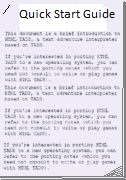
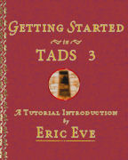
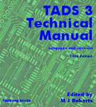
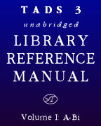
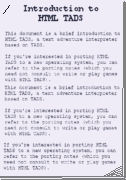

[TADS 3](../../index.html)

::: menu-button
:::

[Adv3Lite Bookshelf](../adv3lite/index.htm){.nav-element} [Adv3
Bookshelf](#){.nav-element .current} [Cheat Sheets](#){.nav-element}

::: {#spacer}
:::

::: main
# The Books

+-----------------------------------+-----------------------------------+
| -------------------------------   |                                   |
+-----------------------------------+-----------------------------------+
| [{.book}](T  | [TADS 3 Quick Start               |
| 3QuickStart.htm){target="_blank"} | Guide](T3QuickStart.htm){.title   |
|                                   | target="_blank"}\                 |
|                                   | by Eric Eve                       |
|                                   |                                   |
|                                   | This brief guide is probably the  |
|                                   | best place to start for newcomers |
|                                   | to TADS 3. It contains            |
|                                   | instructions for installing the   |
|                                   | system and compiling a basic      |
|                                   | game, an explanation of the other |
|                                   | documentation, including guidance |
|                                   | on where to go next, and a sample |
|                                   | game newcomers can experiment     |
|                                   | with if they want to dive         |
|                                   | straight it.                      |
+-----------------------------------+-----------------------------------+
| -------------------------------   |                                   |
+-----------------------------------+-----------------------------------+
| [{.book}]        | [Getting Started in TADS          |
| (gsg/index.html){target="_blank"} | 3](gsg/index.html){.title         |
|                                   | target="_blank"}\                 |
|                                   | by Eric Eve                       |
|                                   |                                   |
|                                   | This tutorial introduction is a   |
|                                   | great starting point for anyone   |
|                                   | new to TADS 3 and new to          |
|                                   | programming. The book opens with  |
|                                   | the basics of getting TADS        |
|                                   | working on your system and        |
|                                   | setting up your first simple      |
|                                   | game, so even if you\'ve never    |
|                                   | done any programming before, this |
|                                   | will help you get going quickly.  |
|                                   | The tutorial then leads you step  |
|                                   | by step through the design of a   |
|                                   | full-scale example game, showing  |
|                                   | how to use TADS to implement the  |
|                                   | effects needed in the game. By    |
|                                   | the time you\'re done, you\'ll    |
|                                   | know your way around the system   |
|                                   | and you\'ll be able to write your |
|                                   | own games.                        |
|                                   |                                   |
|                                   | *This book is accompanied by a    |
|                                   | sample game,* The Further         |
|                                   | Adventures of Heidi*. The game\'s |
|                                   | source files can be found here:*  |
|                                   | [`Heidi.t`](gsg/Heidi.t           |
|                                   | ){target="_blank"}` `[`Heidi.t3m` |
|                                   | ](gsg/Heidi.t3m){target="_blank"} |
|                                   |                                   |
|                                   | *This book can also be viewed in  |
|                                   | a [PDF                            |
|                                   | ver                               |
|                                   | sion](gsg/Getting%20Started%20in% |
|                                   | 20TADS%203.pdf){target="_blank"}. |
|                                   | This version is recommended if    |
|                                   | you want to make a printed copy.* |
+-----------------------------------+-----------------------------------+
| -------------------------------   |                                   |
+-----------------------------------+-----------------------------------+
| [{.book}](learning/Le | 3](l                              |
| arning%20T3.pdf){target="_blank"} | earning/Learning%20T3.pdf){.title |
|                                   | target="_blank"}\                 |
|                                   | by Eric Eve                       |
|                                   |                                   |
|                                   | Part tutorial and part reference, |
|                                   | *Learning TADS 3* is a perfect    |
|                                   | place to start for confident      |
|                                   | beginners, and for people with a  |
|                                   | little more programming           |
|                                   | experience. This book is designed |
|                                   | for learning TADS on your terms - |
|                                   | it\'s organized by functional     |
|                                   | area, so once you\'ve mastered    |
|                                   | the basics, you can skip around   |
|                                   | to focus on the areas you\'re     |
|                                   | most interested in. As you        |
|                                   | develop your game, you can return |
|                                   | to the book as a reference, to    |
|                                   | review the details of particular  |
|                                   | TADS features.                    |
|                                   |                                   |
|                                   | *This book refers to a collection |
|                                   | of sample games, which are        |
|                                   | available as a separate           |
|                                   | download - [click                 |
|                                   | he                                |
|                                   | re](http://www.tads.org/learning_ |
|                                   | tads3_sample_games.htm){.visible} |
|                                   | to download.*                     |
+-----------------------------------+-----------------------------------+
| -------------------------------   |                                   |
+-----------------------------------+-----------------------------------+
| [{.book}](tourg   | [TADS 3 Tour                      |
| uide/index.html){target="_blank"} | Gu                                |
|                                   | ide](tourguide/index.html){.title |
|                                   | target="_blank"}\                 |
|                                   | by Eric Eve                       |
|                                   |                                   |
|                                   | This is a comprehensive overview  |
|                                   | of the TADS 3 library, covering   |
|                                   | nearly all of the key classes and |
|                                   | functions. It uses practical      |
|                                   | examples that illustrate how to   |
|                                   | use library features to           |
|                                   | accomplish common tasks.          |
|                                   |                                   |
|                                   | *This book can also be viewed in  |
|                                   | a [PDF                            |
|                                   | version](tourguide/T              |
|                                   | 3TourGuide.pdf){target="_blank"}. |
|                                   | This version is recommended if    |
|                                   | you want to make a printed copy.* |
+-----------------------------------+-----------------------------------+
| -------------------------------   |                                   |
+-----------------------------------+-----------------------------------+
| [{.book}](s      | [TADS 3 System                    |
| ysman/cover.htm){target="_blank"} | Manual](sysman/cover.htm){.title  |
|                                   | target="_blank"}\                 |
|                                   | by Michael Roberts                |
|                                   |                                   |
|                                   | This book is a reference to the   |
|                                   | TADS 3 language and the T3 VM,    |
|                                   | including the standard intrinsic  |
|                                   | functions and classes. It covers  |
|                                   | the language and VM features in   |
|                                   | depth, so it\'s the place to go   |
|                                   | when you need to find the details |
|                                   | on the system.                    |
+-----------------------------------+-----------------------------------+
| -------------------------------   |                                   |
+-----------------------------------+-----------------------------------+
| [{.book}](te    | [TADS 3 Technical                 |
| chman/cover.htm){target="_blank"} | Manual](techman/cover.htm){.title |
|                                   | target="_blank"}\                 |
|                                   | edited by Michael Roberts         |
|                                   |                                   |
|                                   | This is a collection of technical |
|                                   | articles about key aspects of the |
|                                   | TADS 3 system and the Adv3        |
|                                   | library. These articles provide   |
|                                   | detailed, task-oriented           |
|                                   | information on topics of interest |
|                                   | to most TADS 3 users.             |
+-----------------------------------+-----------------------------------+
| -------------------------------   |                                   |
+-----------------------------------+-----------------------------------+
| [{.book}](li     | [TADS 3 Library Reference         |
| bref/index.html){target="_blank"} | Manual](libref/index.html){.title |
|                                   | target="_blank"}                  |
|                                   |                                   |
|                                   | This is an extensively            |
|                                   | cross-referenced and hyperlinked  |
|                                   | compilation of information on the |
|                                   | Adv3 and system libraries. The    |
|                                   | entire library is indexed here,   |
|                                   | with the latest information       |
|                                   | generated directly from the       |
|                                   | library source code.              |
+-----------------------------------+-----------------------------------+
| -------------------------------   |                                   |
+-----------------------------------+-----------------------------------+
| [{.book}](htm | [Introduction to HTML             |
| ltads/intro.htm){target="_blank"} | TADS](htmltads/intro.htm){.title  |
|                                   | target="_blank"}\                 |
|                                   | by Michael Roberts                |
|                                   |                                   |
|                                   | TADS 3 uses a variant of HTML as  |
|                                   | its formatting language. These    |
|                                   | notes explain how HTML fits into  |
|                                   | TADS, and how you can use HTML    |
|                                   | formatting codes for text         |
|                                   | effects, graphics, and sound, and |
|                                   | how the TADS variant differs from |
|                                   | standard HTML. (These are         |
|                                   | essentially just the original     |
|                                   | notes for HTML TADS 2, so         |
|                                   | they\'re a little rough, but they |
|                                   | are updated with relevant changes |
|                                   | for TADS 3. Note that this isn\'t |
|                                   | an HTML tutorial - but the HTML   |
|                                   | in TADS is pretty close to        |
|                                   | standard HTML, so you can learn   |
|                                   | it from any of the many tutorials |
|                                   | on the Web for ordinary HTML.)    |
+-----------------------------------+-----------------------------------+

------------------------------------------------------------------------

# Change Logs

::: indent
[**TADS 3 System Change History**](t3changes.htm){target="_blank"}. This
is a chronological log of changes to the TADS 3 language, tools, and
Virtual Machine.

[**Adv3 Library Change
History**](../lib/adv3/changes.htm){target="_blank"}. A chronological
log of changes to Adv3, the standard TADS 3 Adventure Framework Library.

[**HTML TADS Interpreter and Workbench Change
History**](changes.htm){target="_blank"}. This is a log of changes to
the HTML TADS user interface, which includes the HTML TADS Interpreter
and the Workbench development environment on Windows.
:::

------------------------------------------------------------------------

# Notes

::: indent
These books are copyrighted by their respective authors. In general,
they may be used and distributed without charge, subject to certain
restrictions. Please see the individual books for full copyright and
licensing information.

[{.margin align="right"
border="0"}](http://www.adobe.com/products/acrobat/readstep.html){target="_blank"}
Some of these books are offered in the \"PDF\" format. To view PDF
files, you need the Acrobat Reader software, which is available as a
[free download from
Adobe](http://www.adobe.com/products/acrobat/readstep.html){target="_blank"}.
:::
:::
