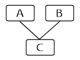
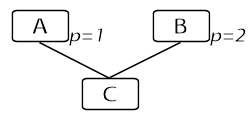
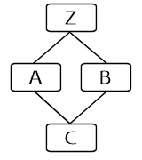
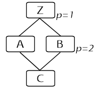

::: topbar
{border="0"}
:::

::: nav
[Table of Contents](toc.htm){.nav} \| [The Language](langsec.htm){.nav}
\> The Object Inheritance Model\
[[*Prev:* The Main Program Entrypoint](startup.htm){.nav}     [*Next:*
Object Definitions](objdef.htm){.nav}     ]{.navnp}
:::

::: main
# The Object Inheritance Model

TADS 3 is at its core an object-oriented programming language. One of
the pillars of object-oriented programming is the concept of
inheritance.

Inheritance comes into play whenever you create a subclass of another
class. The point of subclassing is that you can take an abstract,
general-purpose class - Furniture, say - and create another class that
represents a narrow, specialized slice of the broader class - Chair,
say. The specialized class is a subclass of the general class in that it
represents a subset of the things that the general class can represent:
all chairs are furniture, but furniture includes lots of things that
aren\'t chairs, like tables and cabinets and lamps. You can repeat this
process to make finer and finer subdivisions at each level: Chairs come
in Armchair and Sofa and Rocking varieties, Sofas come in Sleeper and
Loveseat subclasses, and so on.

Once we\'ve started sorting objects into classes and subclasses this
way, the basic idea of inheritance becomes fairly intuitive. Since all
chairs are furniture, we\'d expect that a chair would exhibit all of the
basic behaviors and attributes of furniture in general. That, in a
nutshell, is what we mean by inheritance: a chair inherits its basic
framework of behaviors and attributes from the more general furniture
category.

Inheritance is such a powerful concept because it not only fits so well
with our intuition, but also brings concrete benefits to our programming
model. OOP lets us declare *in the programming language* that Chair is a
subclass of Furniture, and with this information, the compiler
automatically knows that everything we\'ve defined for the Furniture
class automatically applies to the Chair class as well. This is the
concrete meaning of inheritance in OOP, the huge benefit to the
programmer is that we\'re saved the trouble of re-typing all of the
Furniture code on our new Chair class. We simply tell the compiler that
Chair is a subclass of Furniture, and the compiler takes care of the
rest.

Now, if that were all there were to it, there wouldn\'t be much point in
defining a more specialized category like \"chair.\" The whole point of
defining specializations - subclasses - is that a subclass is *mostly*
like its general class, *but not entirely* A chair is *mostly* like any
other furniture, but has some particular features that make it
noticeably different. That\'s what we mean when we say that all chairs
are furniture but not all furniture is chairs.

This is where the concept of \"overriding\" comes from. By default,
Chair inherits everything defined for Furniture. It can add things as
well, things that just aren\'t relevant to furniture in general: maybe
we\'d add cushion thickness and back-rest height. But just as
importantly, we might decide that there are certain attributes or
behaviors that we\'ve defined on the Furniture class that need to be
*changed* for Chair. Maybe we\'ve said that sitting on a piece of
furniture isn\'t allowed in general; we\'d obviously want to change this
for a chair. In other words, Chair would override the \"sitting is
allowed\" behavior that it would otherwise inherit from the base class.

## Multiple Inheritance

It\'s fairly easy to see how inheritance works when we\'re talking about
simple subsets like Chair inheriting from Furniture. There\'s another
situation that\'s a bit more complicated, though.

The good thing about OOP and subclassing and inheritance is that it\'s a
pretty good match to the way our brains naturally work. We\'re all OO
programmers practically from birth because we naturally see the world in
categories and subcategories. The only snag is that all of this
wonderful inbred OOP ability is merely an artifact of human cognition:
it\'s the way we see the world, not the way the world really is. The
real world doesn\'t break up so neatly into simple, non-overlapping sets
of classes and subclasses and sub-sub-classes. In the real world, a
chair is a piece of furniture, but it also might be a Thing Made of
Wood, and a Thing You Can Stand On, and Something You Can Disassemble, a
Thing You Can Throw, a Doorstop, and endless others. When it comes right
down to it, an object\'s \"class\" isn\'t some kind of eternal,
abstract, permanent feature of the object; it\'s just a feature of the
way we happen to be looking at it at the moment.

OOP languages don\'t try to address this \"real world\" problem. After
all, OOP isn\'t a theory of the world, it\'s just a way of organizing
data structures and programming code to make complexity more manageable;
looked at that way, OOP has proven its worth.

Even so, \"single-inheritance\" models are often too restrictive for
real applications. Interactive Fiction is particularly difficult to fit
into a single-inheritance model because it revolves so much around
simulating real-world scenarios. To help ease the limitations of the
single-inheritance model, some OOP languages - including TADS 3 -
include the concept of Multiple Inheritance.

Multiple inheritance is, as you might guess from the name, the ability
to say that a class derives from more than base class. For example, in
our Chair example, we might define Chair as inheriting from Furniture
and from another class called Platform that represents things a person
can sit or stand or lie upon. (Note that we\'re making these up for the
purposes of this chapter only - in particular, these classes don\'t have
anything to do with the adv3 library\'s class tree.)

In the most basic case, multiple inheritance is relatively
straightforward. We define a subclass that\'s based on two superclasses;
the new subclass simply inherits the *combination* of the behaviors and
attributes from the two base classes. Here\'s a diagram showing a new
subclass, C, based on two superclasses, A and B:

(We could also base a subclass on three or more base classes, not just
two. The principles and rules for three or more superclasses are all the
same as for two, though, so we\'ll stick to two superclasses in our
examples for clarity.)

In the simple case, C simply inherits everything that A defines plus
everything that B defines. Things start to get complicated, though, when
there are inheritance \"conflicts\" between the two base classes. What
happens when our two base classes both define the same property *p*? In
other words, in the diagram above, if A.*p*[=]{.code}1, and
B.*p*[=]{.code}2, what value of *p* does C inherit? Here\'s a picture of
what we mean:

Our new notation in the diagram shows property definitions - that little
*p=1* next to A means that A defines property *p* with the value 1. So
now we have A.*p*[=]{.code}1 and B.*p*[=]{.code}2. So, the question is,
what value of *p* does C inherit?

There are a few different theoretical approaches to resolving
inheritance conflicts of this kind. One approach is to consider such
conflicts to be errors. In this view, such a conflict is a sign of a
basic design flaw in the class hierarchy. Some OOP languages take this
approach, and simply count such a conflict as a compilation error. To
fix the error, the programmer must delete *p* from either A or B, or
restructure C\'s superclass list so that it doesn\'t include both A and
B. Some languages that take this \"strict\" approach also let you
resolve the conflict by explicitly overriding *p* in C - that eliminates
the conflict by letting the programmer state exactly what she intended.

TADS 3 takes a more permissive view: it considers these conflicts
perfectly legal, and to resolve them, it defines a \"priority\" rule to
determine which of the conflicting properties \"wins\" in a dispute.

The basic TADS rule for multiple inheritance priority is that the
*leftmost* superclass takes precedence over other superclasses. By
leftmost, we mean the one defined earliest in the superclass list. The
TADS syntax for defining the object C in the diagram above would be like
this:

::: code
    class C: A, B
      // C's own overrides go here...
    ;
:::

In this definition, A is the leftmost superclass of C, since it appears
earliest in the list of superclasses in the [class]{.code} statement
that defines C. So, in case of a conflict between A and B, A wins: C
inherits *p* from A.

Of course, none of this is an issue if C *also* defines *p*, because in
that case we\'d have a simple case of overriding. C.*p* would override
*both* A.*p* and B.*p*, since a subclass definition always overrides
*all* superclass definitions for the same property.

Unfortunately, there\'s one more complication that we have to take into
account, which is this: what if A and B themselves share a common base
class? Consider this diagram:

We now have A as a subclass of Z, B as a sublass of Z, and C as a
subclass of A and B. In terms of TADS definitions, this would look like
so:

::: code
    class Z: object;
    class A: Z;
    class B: Z;
    class C: A, B;
:::

If we still have A and B defining *p*, this doesn\'t change anything - C
still inherits *p* from A because of the \"leftmost superclass\" rule.
But now consider this bizarre situation:

Remember our notation: that little *p=1* next to Z means that Z defines
property *p* with the value 1. So we now have Z.*p*[=]{.code}1 and
B.*p*[=]{.code}2. The question once again is: what value of *p* does C
inherit?

Using our \"leftmost superclass\" rule, we\'d say that the value C
inherits must be 1. If we forget about C for a moment, we can see that A
clearly inherits *p* from Z - this much is obvious. So, given the
\"leftmost\" rule, C must inherit A.*p*, which is 1.

But this is **not** what actually happens. In actuality, C inherits *p*
from B, so if we evaluate C.*p*, we\'ll get 2 as the result. The reason
is that there\'s another rule that supersedes the \"leftmost
superclass\" rule.

The superseding rule is the \"explicit override\" rule. This rule states
that a class that *explicitly* overrides a given property in a base
class *also* overrides that same base class property in a multiple
inheritance situation. In our example, B.*p* explicitly overrides Z.*p*;
this means that B.*p* must take precedence over Z.*p* in this multiple
inheritance situation, so C must inherit *p* from B before it can
inherit the same property from Z. Thus, B.*p* takes precedence.

### Rationale for the \"explicit override\" rule

This isn\'t just an arbitrary technical rule. This is actually a
practical rule designed to make multiple inheritance behave as
intuitively as possible in these \"conflict\" situations.

The point of the rule is this: When the programmer created class B, she
*specifically* and *consciously* decided that B\'s version of *p* was
special - she actually wrote out *p*\'s definition in B by hand, after
all. The programmer personally decided that the version of *p* inherited
from Z was wrong for B and needed to be overridden. In contrast, the
programmer who created class C (who might even be a different
programmer - A, B, and Z might be classes from a library, and class C is
something we\'ve created in our game program) *didn\'t say anything
about p*. The programmer who wrote class C might not even have thought
about *p* - he just knows that he wants to combine the general
functionality inherited from A and B, and hasn\'t necessarily thought
about every individual property and method. The same holds for class A -
the programmer who wrote class A never said anything about *p*, so might
not even have thought about it when writing A; *p* was just inherited by
default. That\'s a big part of OOP\'s appeal, after all: that we can use
classes in our program without having to know every detail about their
internal structures.

So when it comes to deciding on which *p* to inherit in class C, which
seems more important: the first programmer\'s explicit decision to
override Z\'s version - and thus A\'s version - of *p* in class B, or
the second programmer\'s indication that A generally comes before B in
priority order?

TADS 3\'s answer is that the first programmer\'s decision that B.*p*
overrides Z.*p* takes precedence.

### The multiple inheritance rules in summary

Here\'s a summary of the multiple inheritance rules: a class inherits a
property from the leftmost superclass that defines or inherits the
property, *except* that if a superclass further to the right itself
overrides the actual source of that first property, the one to the right
takes precedence.

Stated as an algorithm:

-   If the object in question *directly* defines the property, that\'s
    the definition to use, so we\'re done; otherwise, proceed.
-   Starting at the leftmost superclass, visit each superclass:
    -   If the current superclass defines the property directly *or*
        inherits the property from one of its superclasses, then:
        -   Note the actual *defining* object of the property (if the
            superclass directly defines the property, the defining
            object is the superclass, otherwise it\'s the class that the
            superclass inherits the property from);
        -   If we haven\'t yet found a match, remember this as the new
            match; otherwise, if this defining object is a descendant
            (i.e., a subclass, or a subclass of a subclass, etc) of the
            previous match\'s defining object, remember this as the new
            match; otherwise forget the current match.
        -   In any case, keep going.
    -   In any case, keep going.
-   We\'re done: the last match from the loop is the one to use.

## Where [inherited]{.code} goes next

The rules above for inheritance and multiple inheritance explain how to
find the definition of a property to use when evaluating an initial
property evaluation - a direct property evaluation or a call to a
method, as in [obj.p]{.code}. But there\'s more to inheritance than
this, thanks to the [inherited]{.code} operator.

The [inherited]{.code} operator\'s job is to *continue* the traversal of
the inheritance tree. An initial property evaluation reaches the most
specific override of the property, but then [inherited]{.code} can be
used to call the *next-most specific* version of the property. This
extends the basic benefits of inheritance to a much finer granularity:
not only can we inherit whole properties and methods from base classes,
but we can actually *extend* base class methods by incorporating the
originals into our code even when we override them.

The rules for continuing an inheritance tree traversal with
[inherited]{.code} are actually very simple. [inherited]{.code} just
goes to the instance of the method that the current instance overrides.
In other words, it\'s the instance that *would* have been called if the
current instance had never been defined.

It\'s worth noting that there\'s always a single linear \"inheritance\"
ordering of all of the instances of a given method in a given object\'s
class tree. For example, take our example from earlier:

In C\'s hierarchy, the inheritance order for *p* is \[B, Z\] - in other
words, C inherit *p* first from B, then from Z. We know from the
multiple inheritance rules that B.*p* comes first in the inheritance
order; and if we removed B.*p* from the picture, we can see that we\'d
have gone to Z.*p* first.

The reason we point out this linear ordering is that the \"tree\"
diagrams can often make it seem as though the inheritance is all fuzzy
and non-deterministic, as though there were all sorts of paths through
the tree. But that\'s not really the case: there\'s *always* a unique
linear ordering for the inheritance order. Given a class tree, you can
always work out *exactly* the order in which [inherited]{.code} will
traverse the classes.

There\'s one other thing to note. The traversal order depends on the
*final* subclass we\'re talking about - in other words, it depends on
the actual object we targeted in the initial method call. Each final
subclass has its own tree. The position of a given superclass in the
hierarchy might vary from one - we mixed A and B as superclasses in our
example above, but some other class might mix A and C as superclasses,
or might mix A and B and some other class X. Another object might use B
and A as superclasses rather than A and B, making B take precedence over
A in that case. This means that we can\'t look at a given method and
determine *in isolation* where its [inherited]{.code} calls will go - it
all depends on the full class tree of the final object that\'s involved.
:::

------------------------------------------------------------------------

::: navb
*TADS 3 System Manual*\
[Table of Contents](toc.htm){.nav} \| [The Language](langsec.htm){.nav}
\> The Object Inheritance Model\
[[*Prev:* The Main Program Entrypoint](startup.htm){.nav}     [*Next:*
Object Definitions](objdef.htm){.nav}     ]{.navnp}
:::
