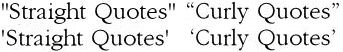
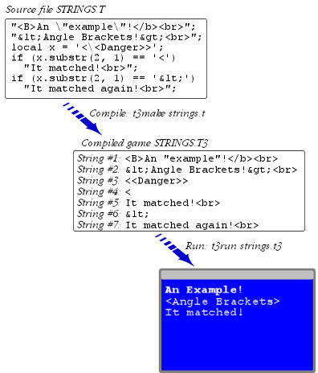

::: topbar
{border="0"}
:::

::: nav
[Table of Contents](toc.htm){.nav} \| [The Language](langsec.htm){.nav}
\> String Literals\
[[*Prev:* Fundamental Datatypes](types.htm){.nav}     [*Next:*
Enumerators](enum.htm){.nav}     ]{.navnp}
:::

::: main
# String Literals

TADS is a language for Interactive Fiction, and IF is made mostly of
text. Naturally, text is a big area of specialization for TADS, where
the language breaks from its C and Java roots. This chapter describes
the special string literal features in TADS.

## The basics

A string literal is a block of text enclosed in quote marks - either
single quotes or double quotes, depending on the kind of string, which
we\'ll come to shortly.

Within the quotes, you can write *almost* any text. There are a few
[special codes](#specials) that TADS interprets specially, which we\'ll
discuss later; but apart from those, text within a string is just
literal text for TADS to store and/or display.

::: code
    "This is a string in double quotes."
    'This is a string in single quotes.'
:::

Unlike most other C-like languages, TADS allows a string to continue
across multiple lines without any special syntax. A TADS string starts
with a quote mark and keeps going until the next instance of the same
kind of quote mark.

::: code
    "This is a string.  A string can go on for
    any number of lines... it keeps going until
    we come to another copy of the same quote
    mark that started the string, which we're
    finally coming to... now!"
:::

When a string is broken across lines, TADS treats it as though it were
written on one line, with a space character in place of each line break.

Note in the example above that we\'re free to use the *other* kind of
quote within a string. If a string starts with a double quote mark, we
can freely use single quotes within the string - they just count as
ordinary text, because the string goes on until we come to another copy
of the same mark that started the string.

But what if you want to use a double quote mark within a double-quoted
string, or single within single? You do this by \"escaping\" the quote
mark, which you do by putting a backslash character in front of it. (The
backslash is this one: \"\\\". It looks like a plank that\'s leaning to
the left, and left equals backwards if you think about it in terms of
left-to-right reading order. Backwards slash → backslash. \"Escaping,\"
by the way, means that you\'re removing the special meaning of the quote
mark as the end-of-string marker, and turning it into an ordinary
literal character within the string.)

::: code
    "Bob said, \"Well, this looks like a quote
    within a quote!\""

    'It\'s less obvious that you need the escapes
    here, isn\'t it?'
:::

Note in the latter example how you need to escape apostrophes within
single-quoted strings. TADS would otherwise think an apostrophe is the
matching single quote that ends the string.

## Two kinds of string literal

TADS has two different types of string literal, which are named
according to the kind of quote mark that encloses them in the program
source code: *single-quoted strings* and *double-quoted strings*. The
names might be a bit awkward, but they make up for it by being obvious,
in that you can tell the type of a string just by looking at its
surrounding quote marks.

The functional difference isn\'t at all obvious, though. It\'s certainly
not something you could guess looking at the syntax. It\'s not even
something you\'d guess from other programming languages. So it\'s
something we need to explain.

Here\'s the difference:

A string in *single quotes* is a string \"value\": a piece of data that
you can assign to a variable, pass as a function argument, chop up with
substring operators, combine with concatenation operators, and do all
the other things that you can do with strings in other programming
languages.

::: code
    // assign a string value to the variable 'str'
    local str = 'This is a string value, because it\'s in single quotes.';

    // now we can manipulate this string value with method calls, etc
    str = str.substr(5);
:::

A string in *double quotes* is a concise way of saying \"Print this
now!\" A double-quoted string *isn\'t* a value. You can\'t assign it to
a variable or otherwise manipulate it. Whenever the current execution
point reaches a double-quoted string, TADS simply prints out the string,
and moves on to the next line of code.

::: code
    "This string prints itself out as soon as it's executed. You can't
    assign it to a variable - it has no value to manipulate.";
:::

## [Triple quotes]{#tripleQuotes}

Single quotes, double quotes\... and now triple quotes?

Don\'t worry: this isn\'t a third type of string. It\'s just another way
of writing the first two kinds.

A triple-quoted string is a string surrounded by *three copies* of its
quote mark on each side - three quote marks at the beginning, and three
more at the end. You might wonder why you\'d want to use three quotes
when one would do. What you gain is the ability to use the quote mark
character freely as literal text within the string, without worrying
about \"escaping\" it with a backslash. The compiler knows that the
string doesn\'t end until it sees the closing triplet, so you can safely
use the quote mark individually (or even in pairs) within the string
without creating any confusion.

A few other C-like languages have adopted similar triple-quote schemes,
since it\'s more convenient and nicer looking for strings that contain
quote marks as part of their literal text. This is a particularly common
occurrence in an interactive fiction language like TADS, where many
strings contain passages of story text.

Here\'s a simple example:

::: code
    desc = """The sign reads "Beware of Backslash!""""
:::

This example is actually a little less simple than it looks. It happens
to illustrates a subtle (and nice) feature of triple quotes. Note how
the string ends with *four* quote marks. Triple-quoted strings that end
with *N*\>3 consecutive quote marks treat the first *N*-3 quotes as part
of the string, and the last three as the delimiter. So when printed,
this message looks just as you\'d want it to:

::: code
    The sign reads "Beware of Backslash!"
:::

Here\'s how you write a string that displays 10 quote marks in a row:

::: code
    """""""""""""""";
:::

That\'s three for the opening delimiter, three for the ending delimiter,
and ten quotes for display. It\'s a little strange looking, but it\'s a
heck of a lot better than `"\"\"\"\"\"\"\"\"\"\""`, which looks more
like an attempt at an ASCII graphic.

You can use triple-quoting with single- and double-quoted strings, and
in both cases the type of quote character determines the type of string
it is, just as with ordinary once-quoted strings:

       local s = '''This is a 'string value', since it's in single quotes.''';
       """This string is printed out "immediately", since it's in double quotes.""";

There\'s one other special feature to be aware of. Most people will
probably never encounter this, because it gets into something that
doesn\'t tend to come up naturally in story text. But this is a
programming language, after all, so we have to consider the weird cases,
too. The question is what happens if you want to write, say, five quotes
in a row as literal text within a triple-quoted string? We\'ve already
seen how to write a bunch of quotes at the *end* of the string: write
the quotes and then just add three more as the ending delimiter. But
what about in the middle of the string?

In this situation we reluctantly have to fall back on the backslash,
since there\'s just no other way that the compiler could know that you
intend for the string to continue after the glob of quotes. But here\'s
where the special feature comes in: you only have to use one backslash
for a whole row of quotes. When the compiler encounters a backslash
followed by a quote within a triple-quoted string, it applies the
backslash to the entire run of consecutive quotes that follow the
backslash.

::: code
    """For whatever reason, I want to write a \"""""quintuple quoted\"""""
    string within this \"""triple quoted\""" string!""";
:::

Other than the tripled delimiters and the treatment of escaped quote
runs, triple-quoted strings work exactly like their ordinary
counterparts. In particular, there\'s no difference in how they behave
at run-time, and no difference in how embedded \<\< \>\> expressions are
handled.

## Line breaks

We mentioned earlier that the compiler treats line breaks in strings as
though they were spaces. Let\'s look at that in more detail.

By default - and we\'ll see in a moment that there are some other
options apart from the default - when the compiler encounters a line
break within a string, it does two things:

-   It removes the line break and replaces it with a space character,
    making it seem as though you had written the whole string on one
    line.
-   It deletes all of the spaces at the beginning of the next line.

The reason for deleting the spaces at the start of the next line after a
line break is that most people like to indent their code to make it more
readable. The compiler assumes that all of the spaces at the start of a
line are for indentation, purely for code readability, and aren\'t
really part of the string.

In some cases, you might want a line break and the subsequent
indentation to be part of the string. For example, if you\'re writing
preformatted display code for an HTML [\<PRE\>]{.code} section, you
might want to use spacing at the start of a line for indentation in the
displayed text. You can do this by writing an explicit [\\n]{.code}
(newline) sequence at the end of each line, just before the line break.
When the compiler sees a line ending in [\\n]{.code}, it keeps all of
the spacing at the start of the next line.

::: code
    f()
    {
        local a = 'test\n
         string';
    }
:::

Because the first line of the string ends in an explicit [\\n]{.code},
the compiler preserves the spaces at the start of the second line, so
the string is stored as though you had written [local a =
\'test\\n]{.code}`     `[string\';]{.code}.

What we\'ve seen so far is the compiler\'s default handling. In addition
to this default behavior, there are two other \"modes\" that do slightly
different things with line breaks.

The default mode that we\'ve been talking about so far is called
\"collapse\" mode, because the compiler collapses all of the spacing at
each line break into a single space character. You don\'t have to do
anything special to select this mode, since it\'s the default, but you
can also turn it on explicitly by adding this to your source file, on a
line by itself:

::: code
    #pragma newline_spacing(collapse)
:::

Once you set a newline spacing mode, it sticks until the end of the
source file, or until you change it with another #pragma. If you set the
mode in an included file, it automatically returns to the enclosing
file\'s mode at the end of the included file, so you don\'t have to
worry when using #include that the file will change the mode on you.

The second newline spacing option is \"delete\" mode:

::: code
    #pragma newline_spacing(delete)
:::

In delete mode, the compiler entirely deletes each line break, and all
of the indentation on the next line. The result is that the two lines
surrounding a line break are mashed together with no spacing at all
between them. Why would you want this? In some languages, especially
ideographic languages such as Chinese, it\'s standard to write text with
no spacing between words. The \"collapse\" mode is inconvenient for
writing long strings in this kind of language because it introduces
unwanted spacing between characters wherever you happen to insert a line
break in the source code just to keep line lengths within the page
boundaries. \"Delete\" mode is good for this type of language because it
lets you break up long lines as needed, but joins everything together
without any unwanted extra spaces when the text is actually displayed at
run-time.

Remember the trick we saw earlier with writing [\\n]{.code} at the end
of a line to preserve exact spacing? That works the same way in delete
mode.

The final mode is called \"preserve\" mode:

::: code
    #pragma newline_spacing(preserve)
:::

In preserve mode, the compiler keeps line breaks and whitespace intact,
exactly as written in the source code. Each line break is replaced by a
[\\n]{.code} (newline) character, and any indentation at the start of
the next line is preserved exactly as written. Preserve mode is useful
when you want precise control over the character-by-character contents
of a string, such as when you\'re writing text to a file, or when
you\'re writing an HTML [\<PRE\>]{.code} section.

## Regular expression literals

There\'s another bit of syntax that looks very similar to the string
literal syntax, but doesn\'t define an ordinary string. You can define a
static [RexPattern](rexpat.htm) object, which represents a [regular
expression](regex.htm), using the \"R\" string syntax:

::: code
    local r = R'%w+';
:::

The regular expression literal syntax consists of a capital \"R\"
followed immediately (with no intervening spaces) by an open quote.
Single and double quotes are interchangeable for regular expression
literals.

For more details, see [regular expression literals](rexpat.htm#rexlit)
in the RexPattern section.

## Plain vs. typographical quotes

Before we go on, there\'s a common point of confusion that we should
address. Most computer fonts include a whole raft of different quote
marks, but when you\'re writing TADS source code, it\'s important that
you only use plain, \"straight\" quotes to mark string literals.

The \"straight quotes\" are so called because their appearance in most
fonts is straight up and down, without any tilt to the left or right.
They\'re *usually* the quotes you get when you press this key (on a
standard US QWERTY keyboard, at least):

{style="margin-left:3em;"}

The thing that\'s confusing is that most computer fonts include an
additional set of quotes known as \"curly\" or \"typographical\" quotes.
These are split into left and right versions, which curl or tilt in
opposite directions. The visual difference is subtle, but it helps to
see the two kinds side by side:

{style="margin-left:3em;"}

Be sure that you always enclose strings in straight quotes. As we said
earlier, that\'s *usually* the kind of quote that you get when you press
the plain-quote key. However, many word processing programs have a
\"smart quotes\" mode that automatically substitutes curly quotes when
you press that key. If you\'re using that kind of program, you\'ll need
to turn off the \"smart quotes\" mode while writing TADS code.

Not all fonts show plain quotes as *exactly* straight up and down. Some
fonts show a slight tilt even for plain quotes, for aesthetic value.
That\'s purely visual, of course, and it doesn\'t matter to TADS since
TADS doesn\'t know or care what font you\'re using in your text editor.
If you can\'t tell for sure which quote is which, one trick to try is to
change your editor program\'s font to a monospaced, \"typewriter style\"
font such as Courier. That should make it easy to distinguish the
different quote types visually. Once you\'ve confirmed that you\'re
using the correct quotes, you can switch back to whatever font you
prefer.

Note that it\'s okay to use curly quotes *within* a string, since any
text is allowed there. TADS is only picky about the quotes that
*surround* a string (or \"delimit\" it, in techno jargon).

## []{#specials}Special characters in strings

Earlier, we mentioned that there are a few special codes that TADS
interprets within strings. Let\'s look at the full list.

The first is the quote marks themselves. The quote mark that opens a
string is also the character that ends the string, so if you want to use
that quote mark within the string you need to \"escape\" it by putting a
backslash \"\\\" in front of it.

::: code
    "Bob said, \"Remember those backslashes!\""
:::

(Of course, no backslash is needed within [triple-quoted](#tripleQuotes)
strings, unless you want to use three or more of the quote marks in a
row.)

The second is the [embedded expression](#embeddings) syntax. This
consists of two less-than signs \"[\<\<]{.code}\", followed by an
expression to evaluate, followed by two greater-than signs
\"[\>\>]{.code}\". TADS interprets any [\<\<]{.code} sequence in a
string as the start of an embedding, so if you actually want your string
to literally include two less-than signs in a row, you must escape one
of them (either one will do).

::: code
    'The sign reads "\<<Danger!>>"'
:::

The third is the backslash character itself. Since it has this special
meaning of escaping other special characters, it is itself a special
character. Naturally, then, if you want to use a backslash literally in
a string, you escape it by adding *another* backslash in front of it. In
other words, you write two backslashes in a row to indicate one literal
backslash.

::: code
    "This is what a backslash looks like: \\."
:::

In addition to escaping special characters, the backslash is also used
to generate additional special characters. For example, [\\n]{.code}
represents a newline character. A full list of these special
combinations is [below](#backslash).

Those are all of the characters that affect how the *compiler* reads
your string contents: quotes, [\<\<]{.code} sequences, and backslashes.
Everything else, the compiler reads literally, and stores in your
compiled program as you wrote it.

Once your program is running, though, there\'s another layer of string
interpretation that you need to be aware of. Whenever you *display* a
string, by printing it to the console for the user to see, the TADS
*interpreter* processes any HTML markups in the printed text. The
compiler simply ignores HTML codes, leaving it to the interpreter to
process them.

There are two kinds of HTML markups: tags and entities.

An HTML tag is a sequence enclosed in [\<angle brackets\>]{.code}, such
as [\<B\>]{.code} or [\<A HREF=\"link\"\>]{.code}. (Note that \"angle
brackets\" is just another term for less-than and greater-than signs.
They\'re exactly the same characters, *not* a new kind of quote mark.)
In TADS, HTML tags are mostly used to control text formatting. TADS uses
most of the standard HTML 3.2 tags, which you can find more about in any
HTML reference. Some common tags that TADS recognizes:

-   [\<b\>text\</b\>]{.code} - show *text* in boldface
-   [\<i\>text\</i\>]{.code} - show *text* in italics
-   [\<u\>text\</u\>]{.code} - show *text* underlined
-   [\<a href=\"URL\"\>text\</a\>]{.code} - show *text* hyperlinked to
    *URL*
-   [\text\</font\>]{.code} - show *text* in the
    typeface Arial
-   [\text\</font\>]{.code} - show *text* in red
-   [\text\</font\>]{.code} - show *text* a little larger
    than normal
-   [\text\</font\>]{.code} - show *text* in very large
    type
-   [\<body bgcolor=\"gray\"\>]{.code} - change the window background
    color to gray
-   [\<h1\>heading\</h1\>]{.code} - display *heading* as a large section
    heading
-   [\<h2\>heading\</h2\>]{.code} - display *heading* as a sub-heading
-   [\<h3\>heading\</h3\>]{.code} - display *heading* as a
    sub-sub-heading
-   [\text\</font\>]{.code} - show *text* with a
    blue background
-   [\<center\>text\</center\>]{.code} - show *text* centered in the
    window
-   [\]{.code} - display an image
-   [\<sound src=\"music.mp3\"\>]{.code} - start playing back an audio
    file
-   [\<p\>]{.code} - start a new paragraph
-   [\<br\>]{.code} - show a line break
-   [\<ul\> \<li\>list item \<li\>list item \</ul\>]{.code} - show a
    bullet list
-   [\<table\>\...\</table\>]{.code} - format a table

An HTML entity is spelled-out version of a single character. Entities
are written as [&name;]{.code} - ampersand, name, semicolon. For
example, [&lt;]{.code} is the entity markup for a less-than sign,
[&gt;]{.code} is a greater-than sign, and [&amp;]{.code} is an
ampersand. (You can check any HTML reference for a full list.)

The [&]{.code} is what triggers an entity interpretation, so if you want
to use an [&]{.code} literally in displayed text, you need to spell it
out as [&amp;]{.code}. (Were you thinking of using a backslash?
Remember, the backslash only escapes characters at the compiler level.
An [&]{.code} in a string isn\'t special to the compiler - it\'s only
special to the HTML display engine. To sneak special characters past the
HTML display system, you have to use HTML entities, not backslashes.)

### Compiler vs. HTML interpretation

As we\'ve just seen, there are two quite separate stages where TADS
interprets the contents of your strings. For the most part you won\'t
find yourself worrying about the details. On occasion, though, it can
save you a ton of hair-pulling if you have a good understanding of
what\'s really going on as a string makes its way from your source code
file, into the compiled program\'s memory at run-time, and finally out
to the display.

There are two key things to know. The first one is how a given string is
actually **stored** in memory. The second is how a given stored string
is **displayed** when printed.

The *compiler* special characters - quotes, backslashes, and
[\<\<]{.code} sequences - affect what\'s *stored* in your compiled
program. The *HTML* sequences only affect what\'s *displayed* on the
user\'s screen at run-time. The compiler doesn\'t do anything to
interpret HTML; it simply copies HTML markups character-for-character
into the compiled program, where they\'re stored as part of the text in
a string. There, the power of the HTML lies dormant, until the string is
printed to the screen.

Here\'s an example showing the three stages of a string\'s lifecycle:
the way it appears in the original source code; the way it\'s stored in
the compiled \".t3\" file (which is the same way it\'s loaded into
memory when the program runs); and the way it looks when the user sees
it on the display. (Note that this is just a program fragment - it\'s
not a complete working program.)

{style="margin-left:3em;"}

It\'s worth taking a few minutes to make sure you understand the various
pieces of the picture.

First, note how the backslashes in the source code disappear in the
compiled version. This is because the compiled version stores strings as
objects; they no longer need quotes to mark where they start and stop,
so the embedded quotes can be stored directly, without escapes. The same
applies to the [\<\<]{.code} sequence in the \"[\<\\\<Danger\>\>]{.code}
string: the backslash disappears from the stored copy because the
compiler has finished interpreting it, making it unnecessary to escape
the compiler-only [\<\<]{.code} sequence.

The removal of the backslashes is important when you manipulate a string
in the program. [x.substr(2, 1)]{.code} extracts the second character of
the string. Since the backslash is no longer there, the second character
is now the second [\<]{.code} character.

Second, observe that the HTML sequences are *not* removed from the
strings or translated in any way. They\'re just copied
character-for-character to the compiled version. The [&lt;]{.code}
entities, for example, are actually stored as the chararacters
[&]{.code} [l]{.code} [t]{.code} [;]{.code} - they\'re not converted to
[\<]{.code} characters. Note also that your program code can tell the
difference: when you compare a stored [\<]{.code} character to the
string [\'\<\']{.code}, you get a match. When you compare it to the
string [\'&lt;\']{.code}, it *doesn\'t* match, because the latter is
actually stored as [&]{.code} [l]{.code} [t]{.code} [;]{.code} and thus
doesn\'t match a string stored as [\<]{.code}.

Third, you can see that when the running program writes out any of these
strings to the display, the HTML is finally interpreted. The
[&lt;]{.code} sequences finally turn into [\<]{.code} characters, and
the tags such as [\<B\>]{.code} serve their control function rather than
appearing as literal text.

Displaying a string doesn\'t change the stored copy of the string, of
course. The display process is strictly one-way, from the program memory
to the display window. A string stored in memory still has its original
HTML markups after it\'s displayed. That way if you print the string
again, you get the same display result.

## []{#embeddings}Embedded expressions

The \"interactive\" part of interactive fiction usually means that
conditions in the game world change as the player progresses through the
game. That game world is presented through the text the program
displays, so as the world evolves, so must the text. This makes it
especially important to have a convenient way to write text that varies
according to the world model.

In most programming languages, the standard approach to write varying
text is to build it up by combining some static fragments with others
that change depending on the current state of the game. To take a simple
example, suppose we want to describe a door that can be opened and
closed. Most of the description never changes, but the part that
mentions the current state of the door does. So our first attempt at a
description procedure might look like this:

::: code
    "It's a sturdy-looking oak door, ten feet high. A weathered
    wrought iron knocker is centered just above your eye level.
    The door ";
    if (door.isOpen)
      "stands open.";
    else
      "is firmly shut.";
:::

That works fine, but it takes a fair amount of typing. And if you
consider the number of messages in a typical game that might need the
same treatment, it can add up to *a lot* of typing. It\'s also a bit
hard to read, since the string elements are so disjoint, broken up as
they into several statements. And if you\'re writing this as an object
property value, it adds even more to the required syntax, since you have
to go from a plain property definition like this:

::: code
    desc = "It's a sturdy-looking oak door, ten feet high."
:::

\...to a method-style definition, like this:

::: code
    desc { "It's a sturdy-looking oak door, ten feet high."; }
:::

It\'s not a lot of extra syntax, but again, in a typical game you\'ll be
writing these sorts of snippets many times, so they add up.

What\'s more, some descriptions can get quite a lot more complex than
our door example. Room descriptions in particular tend to have lots of
moving parts. Think about how complex this approach would get if you had
five or six varying passages interposed.

This is where embedded expressions come in. Expression embedding (some
programming languages call it \"interpolation\") is a special syntax
that lets you insert variables, expressions, and even control flow code,
right into a string. This can be much more succinct than writing it out
as a series of separate statements, as we did above.

The embedding syntax is simple. Anywhere in a string, you can write
[\<\<]{.code} - two less-than signs - to drop into \"expression mode.\"
At that point you can write any expression. An expression can be the
name of a local variable, a constant value such as a string or number, a
call to a function or method, a sum with \"+\", or just about anything
else you could write in an ordinary expression outside of the string. At
the end of the expression, write [\>\>]{.code} - two greater-than signs,
the mirror image of the [\<\<]{.code} that started the embedding. That
returns you to string mode, so you\'re back to writing static literal
text in the string.

When a double-quoted string is displayed, TADS first displays the part
of the string up to the first [\<\<]{.code}, then it evaluates the
expression inside that first [\<\< \>\>]{.code} section. This expression
could be another double-quoted string, or a call to a method that prints
something out. Or, it could be a call to a function that returns a
string value, or a number, or some other value. If the expression
returns a value, TADS prints out this value, assuming it has a printable
form. Strings and numbers are printed in the obvious way. Most other
objects don\'t have any kind of automatic printed form, though;
embeddings should only use values that are printable. Next, TADS prints
the next part of the string - the part up to the *next* [\<\<]{.code}
embedding, or to the end of the string if this was the last one. This
process repeats until the whole string and all of its embeddings have
been printed.

::: code
    local i = 3, j = 'boo';
    "The value of i is <<i>>, and j is <<j>>! ";
       // prints out: The value of i is 3, and j is boo!
:::

Going back to our door example, we can use an embedding to rewrite it
like this:

::: code
    "It's a sturdy-looking oak door, ten feet high. A weathered
    wrought iron knocker is centered just above your eye level.
    The door <<door.isOpen ? "stands open" : "is firmly shut">>.";
:::

Rather than ending the string at the point where we need the varying
message about the door\'s status, we use [\<\< \>\>]{.code} to embed an
expression that prints the variable part. The expression uses the [?
:]{.code} conditional operator to test the current status, displaying
one string if the door is open and another if it\'s closed. At the end
of the expression we go back into the string text, where we add the
closing period and end the message.

This is obviously a lot less typing than the original way we wrote it,
and it\'s a bit easier to read, too. It also lets you use the simpler
property-value syntax if the string is used as an object property:

::: code
    desc = "It's a sturdy-looking oak door, ten feet high. A weathered
           wrought iron knocker is centered just above your eye level.
           The door <<isOpen ? "stands open" : "is firmly shut">>.";
:::

### Nested embeddings

Starting in version 3.1.3, it\'s legal to put one embedding inside
another. For example:

::: code
    "The refrigerator door is <<
      isOpen ? "open<<isLit ? " and the light inside is on" : "">> : "closed">>. ";
:::

The most common situation where nesting comes in handy is with
conditional expressions, such as in our example above. Note that you can
often accomplish the same thing with more readable code using the
[\<\<if\>\>]{.code} notation, described later in this chapter. For our
example above, we could instead write this:

::: code
    "The refrigerator door is <<if isOpen>>open<<if isLit>> and the
    light inside is on<<end>><<else>>closed<<end>>. ";
:::

There\'s a limit on the nesting depth (currently 10 levels). The
compiler will display an error if you exceed the maximum depth.

### []{#embedSgl}Embeddings in single-quoted strings

Starting in TADS 3.1, single-quoted strings can also contain embeddings.
The syntax is exactly the same as for double-quoted strings: an
embedding starts with [\<\<]{.code} and ends with [\>\>]{.code}, and
between the two brackets you write an ordinary expression.

When a single-quoted string is evaluated, the process is almost the same
as for double-quoted strings. Rather than printing anything, though,
TADS concatenates the pieces together to create a string result value.
The new string starts with the part of the source string up to the first
[\<\<]{.code}. Then TADS evaluates the first [\<\< \>\>]{.code}
expression, and concatenates the value to the result string. TADS then
concatenates the next source string segment to the result. This process
repeats as before. At the end of it we have a string value that combines
all of the static bits with all of the embedded expression values, in
the order in which they appear in the source code.

::: code
    local i = 3, j = 'boo';
    local s = 'The value of i is <<i>>, and j is <<j>>!';
       // s now contains 'The value of i is 3, and j is boo!'
:::

A single-quoted string is assembled into a final value *at the moment of
evaluation*. It won\'t change to reflect changes in the underlying
variables. Let\'s continue our example:

::: code
    "s is: <<s>>\n";
    i = 7;
    j = 'boo hoo';
    "s is now: <<s>>\n";
:::

This prints out:

::: code
    s is: The value of i is 3, and j is boo!
    s is now: The value of i is 3, and j is boo!
:::

Even though we changed [i]{.code} and [j]{.code} after setting
[s]{.code}, [s]{.code} doesn\'t change - it just stores the character
string assembled in the original assignment. Usually, this is just what
you want. But if for some reason you want a \"live\" string that
automatically updates every time you use it, you can use an anonymous
function:

::: code
    local i = 3, j = 'boo';
    local s = {: 'The value of i is <<i>>, and j is <<j>>!'};
    "s is: <<s()>>\n";

    i = 7;
    j = 'boo hoo';
    "s is now: <<s()>>\n";
:::

This prints:

::: code
    s is: The value of i is 3, and j is boo!
    s is now: The value of i is 7, and j is boo hoo!
:::

Note that you\'ll usually want to avoid calling routines that print out
messages from within single-quoted string embeddings. Messages that are
printed out aren\'t returned as values, so they won\'t be concatenated
into the string result - they\'ll just appear on the screen *at the time
the string is evaluated*, which will probably be out of context.

sprintf-style formatting

Starting in 3.1.1, you can specify a [sprintf()](tadsgen.htm#sprintf)
formatting code directly in an embedded expression, to customize how the
value is displayed. To do this, place the [%]{.code} code immediately
after the opening [\<\<]{.code}, without any intervening spaces. For
example:

::: code
    local x = 100;
    "x in octal is <<%o x>>\n";
:::

The compiler internally turns this into a call to sprintf() with the
given format code, as though you had written:

::: code
    "x in octal is <<sprintf('%o', x)>>\n";
:::

Since it\'s really just a call to sprintf(), you can use any format code
that sprintf() accepts.

Custom embedding syntax with string templates

The basic embedded expression syntax is powerful, since it lets you
write any TADS expression. The drawback is that it makes a sort of
Frankenstein\'s monster out of a string, switching back and forth
between English text and programming code. The code syntax tends to
interrupt the flow of the English text, making it harder to see how the
final output will look.

The \"string template\" syntax can help with this. A string template is
a custom phrase that you define for use in string embeddings. The
compiler converts the phrase into a function call. This lets you get the
effect of a function call without having to write the technical looking
function call syntax.

For example, suppose we want to print out the current score, but in
words rather than as digits - \"twenty points\" rather than \"20
points\". The general-purpose way of doing this is to make a call to a
number-speller function:

::: code
    "Your current score is <<spellInt(score)>> points.";
:::

To make this read a little better, we could define a template for the
spellInt() function. Rather than explicitly calling the function, we
write an English-like phrase. Here\'s how we define the template:

::: code
    string template <<* in words>> spellInt;
:::

The definition starts with the keywords [string template]{.code}. Next
comes the list of keywords for the template, enclosed in the same [\<\<
\>\>]{.code} brackets used for an embedding. Finally, you give the name
of the function to call when the template is invoked.

The {\*} in the template means \"the expression part goes here\". This
can come at the beginning (as in this example), at the end, or in the
middle of the phrase - whatever works best for the wording you\'re
using. When the compiler matches the template in an embedding, it takes
the part that matched the [\*]{.code} and treats them as another
embedding:

::: code
    "Your current score is <<score in words>> points.";
:::

The compiler matches this to our [\<\<\* in words\>\>]{.code} template.
The part that matches the [\*]{.code} is [score]{.code}, so the compiler
turns this into a function call to [spellInt(score)]{.code}. You could
just as well write:

::: code
    "Doubling your score would give you <<score*2 in words>> points.";
:::

This time the [\*]{.code} matches [score\*2]{.code}, so the compiler
turns this into a call to [spellInt(score\*2)]{.code}.

The [\*]{.code} in a template is optional. If you write a template
without a [\*]{.code}, it will only match an embedding that\'s exactly
the phrase given in the template (with no added words), and the compiler
calls its associated function with no arguments. For example:

::: code
    string template <<player location>> playerLoc;
    playerLoc() { return gPlayerChar.location.name; }
:::

Now we can write

::: code
    "You are in <<player location>>."
:::

It\'s possible to create ambiguous templates, where two or more
templates could match the same input. If there\'s any ambiguity, the
compiler goes in the order of definition: the first template defined
wins.

Template invocations can be nested. After the compiler matches one
template, it goes back over the tokens that matched the [\*]{.code} and
checks them for another template match. If it finds one, it checks again
for a third template match, and so on. There\'s one exception: if the
entire template matched is [\<\<\*\>\>]{.code}, the compiler doesn\'t
check for another template, since this would just keep matching that
same [\<\<\*\>\>]{.code} template over and over.

Here\'s an example of how we could use nested templates:

::: code
    string template <<* in words>> spellInt;
    string template <<twice *>> times2;

    "x doubled is <<twice x in words>>.";
:::

The order of the templates in a situation like this is important. Since
[\<\<\* in words\>\>]{.code} is defined first, it matches first, so the
compiler turns this into a call to [spellInt(twice x)]{.code}. But
before doing that, the compiler checks what\'s left over - [twice
x]{.code} - to see if it matches another template. It does, so the
compiler turns that into [times2(x)]{.code}. The overall result is then
[spellInt(times2(x))]{.code}.

A [string template]{.code} statement has to be at the \"top level\" of
your program, outside of any function or object definitions. String
template definitions are **local to a single source module**, so the
best way to make them available throughout your program is to put them
all in a central \".h\" header file that you #include in each source
file.

### [Embedded conditions with [\<\<if\>\>]{.code}]{#embeddedIf}

We\'ve seen how we can embed conditional tests in strings using the
[?:]{.code} operator. That\'s a very flexible approach, but the syntax
can be a little awkward. Using it to place multiple strings in an
embedding makes for a lot of quote marks, and interrupts the reading
flow of the text.

The embedded expression syntax has a special if-then-else feature that
can make code more readable. Here\'s a another way to write the
open/closed door example we saw earlier:

::: code
    desc = "It's a sturdy-looking oak door, ten feet high. A weathered
           wrought iron knocker is centered just above your eye level.
           The door <<if isOpen>>stands open<<else>>is firmly shut<<end>>. ";
:::

[\<\<if\>\>]{.code} evaluates the expression you give it as a condition.
If the condition is true, it continues on to the text immediately
following the [\<\<if\>\>]{.code}. If the condition is false, the
[\<\<if\>\>]{.code} skips that text, and instead looks for a matching
[\<\<else\>\>]{.code}. If it finds one, it continues from there.
Otherwise it keeps going until it finds the matching
[\<\<end\>\>]{.code} label, and proceeds from there.

You can leave out the [\<\<else\>\>]{.code}, in which case the
[\<\<if\>\>]{.code} simply skips ahead to the [\<\<end\>\>]{.code} if
the condition is false. In fact, you can even leave out the
[\<\<end\>\>]{.code}, in which case the [\<\<if\>\>]{.code}
automatically ends at the end of the overall string. This lets you write
nice concise code for simple cases like this:

::: code
    desc = "It's an old rag. <<if isDamp>>It seems a bit damp. "
:::

You can write an [\<\<if\>\>]{.code} with multiple branches, using the
sequence [\<\<else if\>\>]{.code}:

::: code
    desc = "The ball is made of <<if color == 1>>bright red<<
           else if color == 2>>green<<else if color == 3>>navy blue<<end>>
           plastic. "
:::

The entire series of [\<\<if\>\>]{.code}\...[\<\<else
if\>\>]{.code}\...[\<\<else if\>\>]{.code}\...[\<\<else\>\>]{.code}
branches counts as a single \"if\", so only one [\<\<end\>\>]{.code} is
needed for the whole thing. By the same token, only one plain
[\<\<else\>\>]{.code} is allowed for the whole sequence, and it must be
the last branch. At run time, exactly one of the branches will be taken,
since the branches are all mutually exclusive.

You can also nest an [\<\<if\>\>]{.code} within another
[\<\<if\>\>]{.code} for more complex conditions:

::: code
    desc = "The refrigerator door is <<if isOpen>>open<<if isLit>> and the
           light inside is on<<end>><<else>>closed<<end>>. "
:::

Nesting works in the obvious way, with each [\<\<end\>\>]{.code} and
[\<\<else\>\>]{.code} pairing up with an [\<\<if\>\>]{.code} from the
\"inside out\" in the nesting order. So in the string above, the first
[\<\<end\>\>]{.code} pairs up with [\<\<if isLit\>\>]{.code} - which
makes the [\<\<else\>\>]{.code} go with [\<\<if isOpen\>\>]{.code},
since [\<\<if isLit\>\>]{.code} is finished at that point. If we run the
string with the different combinations of [isOpen]{.code} and
[isLit]{.code}, here\'s what we\'ll get:

::: code
    isOpen=nil, isLit=nil:   The refrigerator door is closed.
    isOpen=nil, isLit=true:  The refrigerator door is closed.
    isOpen=true, isLit=nil:  The refrigerator door is open.
    isOpen=true, isLit=true: The refrigerator door is open and the light inside is on.
:::

You can nest [\<\<if\>\>]{.code}\'s to any depth - you\'re not limited
to just putting one [\<\<if\>\>]{.code} inside another. Of course,
whether the result remains readable is another matter.

Speaking of readability, there are two extra keywords you can use with
[\<\<if\>\>]{.code} structures. First, you can use
[\<\<unless\>\>]{.code} in place of [\<\<if\>\>]{.code} to test that a
condition *isn\'t* true. [\<\<unless x\>\>]{.code} means exactly the
same thing as [\<\<if !x\>\>]{.code}, but most people find it a little
less taxing on the brain to rephrase a negative like this, and in any
case it cuts down on punctuation.

::: code
    desc = "An old sepia photo of a group of dour, serious men in suits.
            <<unless moved>>It hangs on the wall at a crooked angle. "
:::

You can use [\<\<else\>\>]{.code} with [\<\<unless\>\>]{.code} as well:

::: code
    desc = "An imposing metal box five feet on a side, painted a drab green.
            <<unless isOn>>It sits inertly in the center of the chamber.
            <<else>>It hums and vibrates with an internal energy that seems
               only barely contained. "
:::

The second variation is that you can substitute the word \"otherwise\"
for \"else\". These are pure synonyms; both are allowed simply to let
you use the wording you find more intuitive. Note that [\<\<otherwise
unless\>\>]{.code} is valid as well - it simply means the same thing as
[\<\<else if !\...\>\>]{.code}.

### []{#oneof}Random (and other) selections with [\<\<one of\>\>]{.code}

Another special syntax makes it easy to create messages with
alternatives that are chosen randomly or sequentially. This is handy for
reducing repetition in messages that are displayed repeatedly, such as
atmospheric messages or random NPC behavior.

The basic structure of a message with random alternatives looks like
this:

::: code
    "The sphere is currently glowing a ghostly <<one of>>red<<or>>green<<or>>blue<<at random>>. ";
:::

The list of alternatives starts with [\<\<one of\>\>]{.code}. After this
you simply write the alternatives, separated by [\<\<or\>\>]{.code}. At
the end of the list, you write one of the following, which not only ends
the list but also specifies how to pick an alternative each time the
message is displayed:

-   [\<\<cycling\>\>]{.code} - run through the alternatives in the order
    listed, and after showing them all, start over again at the first
    item.
-   [\<\<stopping\>\>]{.code} - run through the alternatives in order,
    and after showing them all, just keep showing the last item from
    then on.
-   [\<\<purely at random\>\>]{.code} - choose an alternative at random
    each time the message is displayed. Each item has the same
    probability, so if there are three alternatives, each one will be
    chosen about a third of the time. \"Purely\" at random means that
    each pick is completely independent of the previous picks, the same
    as rolling dice or flipping a coin.
-   [\<\<then purely at random\>\>]{.code} - run through the items in
    order once, and after showing them all, behave like [\<\<purely at
    random\>\>]{.code}.
-   [\<\<at random\>\>]{.code} - same as [\<\<purely at
    random\>\>]{.code}, except that the same item won\'t be chosen twice
    in a row, to reduce the appearance of obvious repetition. Don\'t use
    this when there are only two options, since this forces an
    alternating sequence, A B A B A B\...
-   [\<\<then at random\>\>]{.code} - run through the items in order
    once, and after showing them all, behave like [\<\<at
    random\>\>]{.code}.
-   [\<\<as decreasingly likely outcomes\>\>]{.code} - this is similar
    to [\<\<purely at random\>\>]{.code}, but with skewed probabilities.
    The items are assigned relative probabilities starting at 1 for the
    last item, 2 for the second to last, 3 for the third to last, and so
    on. This makes the first item *N* times as likely as the last in an
    *N*-item list.
-   [\<\<shuffled\>\>]{.code} - shuffle the items into a random order,
    like a deck of cards, and run through the whole list in that order.
    After showing all of the items, shuffle them again and start over.
    This reduces repetition by going through the whole list before
    repeating an item.
-   [\<\<then shuffled\>\>]{.code} - run through the items once in the
    order written, and after showing them all, act like
    [\<\<shuffled\>\>]{.code}.
-   [\<\<half shuffled\>\>]{.code} - similar to
    [\<\<shuffled\>\>]{.code}, but only shows half the items before
    re-shuffling. Oddly, the very lack of repetition in shuffled mode is
    sometimes discernible as a pattern in its own right. This approach
    can help reduce that effect.
-   [\<\<then half shuffled\>]{.code} - run through the items once in
    the order written, and after showing them all, act like [\<\<half
    shuffled\>\>]{.code}.
-   [\<\<sticky random\>\>]{.code} - pick an item at random the first
    time the message is displayed, then show that same item every time.
    This is useful for \"replay\" variation, since it lets you set up a
    detail that varies each time the game is played, but which remains
    consistent within a single run-through.

[\<\<one of\>\>]{.code} structures can be nested, and
[\<\<if\>\>]{.code} and [\<\<one of\>\>]{.code} can be nested within one
another.

For each [\<\<one of\>\>]{.code} structure, the compiler creates an
unnamed object of class OneOfIndexGen, as the \"index generator\" for
the list. This class is defined in the system library file \_main.t,
which is normally included automatically in the build. (\"Normally\"
means as long as you don\'t use the compiler\'s [-nodef]{.code} option
to exclude \_main.t.)

One-time only messages with [\<\<first time\>\>]{.code}

Some passages are only meant to be seen once, the first time they\'re
encountered. The [\<\<first time\>\>]{.code} syntax makes this easy:

::: code
    desc = "Tightly packed sandstone blocks line the walls of this
       musty chamber.  The floor is cracked and tilts at odd angles,
       and the ceiling sags so low in places you have to crouch.
       <<first time>>You realize you're probably the first person
       to set foot here in at least a thousand years.<<only>>"
:::

The text between [\<\<first time\>\>]{.code} and the matching
[\<\<only\>\>]{.code} will only be displayed the first time the overall
string is displayed. After that it\'ll disappear from the enclosing
text.

Alert readers will notice that [\<\<first
time\>\>]{.code}\...[\<\<only\>\>]{.code} is the same as [\<\<one
of\>\>]{.code}*first time
text*[\<\<or\>\>]{.code}[\<\<stopping\>\>]{.code}. In fact, the compiler
processes [\<\<first time\>\>]{.code} by rewriting it exactly as such.
So the extra syntax isn\'t really needed, but this is such a common
motif in IF authoring that it\'s nice to have a more concise way of
writing it.

### More on evaluation timing, and a warning on side effects

It\'s important to keep in mind that a string with an embedded
expression is \"live\". The embedded expression is re-evaluated every
time the string itself is evaluated, and the new, current value is used
in the result.

Let\'s look more closely at how this evaluation timing works. When you
write a string as part of a function, it\'s fairly simple to see when it
gets evaluated: it\'s evaluated when that particular line of code is
executed.

::: code
    test(x)
    {
       local s = 'The current value of x is <<x>>.';
       s = s + '\n';
       return s;
    }
:::

Here, the embedding is evaluated just once each time through the test()
function. Once we evaluate the [\<\<x\>\>]{.code} expression, we have
our final string. The next line where we append a newline to the string
doesn\'t re-evaluate the expression, since we already have our final
string. Likewise, when we [return s]{.code}, we return that final string
value we already computed, so we don\'t evaluate the expression again.

It\'s a little more subtle when we put the string into a property value:

::: code
    orb: Thing 'orb' 'orb'
        desc = "The orb is glowing a bright <<color>>. "
        color = '<<one of>>red<<or>>blue<<or>>green<<cycling>>'
    ;
:::

It might appear at first glance that we\'re assigning a final value of
the string to [color]{.code}, just as we did in the function. But
that\'s not what happens; the [color]{.code} property in this case is
actually a method. The compiler treats it exactly as though you\'d
written this:

::: code
    color()
    {
       return '<<one of>>red<<or>>blue<<or>>green<<cycling>>';
    }
:::

This means that each time you evaluate [orb.color]{.code}, you\'ll get a
new result, since the \"one of\" selection occurs dynamically on each
evaluation. So each time we EXAMINE ORB, it will change color.

This internal conversion to a method always happens when you use
embedded expressions. In fact, it happens when you use any sort of
dynamic expression in a method definition. The same thing happens if you
write something like this:

::: code
    orb: Thing
       weight = (rand(5))
    ;
:::

Any time a property definition contains a dynamic expression value, the
compiler automatically turns the property into a method that evaluates
the expression and returns the result. Strings with embedded expressions
are just a special way of writing a dynamic expression, so they get the
same treatment.

You should be especially careful with embedded expressions that have
side effects. A \"side effect\" expression is one that makes some global
change in the program, such as [++]{.code} or [\--]{.code} expressions,
assignments, or calls to functions that print text. For example:

::: code
    blob: Thing 'blob' 'blob'
       desc = "It just keeps growing; it's now up to <<++size>> feet across! "
       size = 0
    ;
:::

Every time we evaluate [desc]{.code}, the size will go up by a foot.
That means that EXAMINE BLOB will cause it to grow.

Things get even more complicated when we combine properties, lists, and
string embeddings. Consider this example:

::: code
    atmosphereList: object
       eventList = [
          'To err is human; to really screw things up you need
          <<one of>>a computer<<or>>a committee of experts<<or>>an
          Act of Parliament<<or>>Vulcan logic<<or>>a roomful of
          lawyers<<cycling>>. ' ,

          'This message has displayed <<if ++count == 1>>once<<
          else if count == 2>>twice<<else>><<count>> times<<end>>. '
       ]
            
       count = 0

       getNext()
       {
           if (curIndex > eventList.length())
               curIndex = 1;

           return eventList[curIndex++];
       }
       curIndex = 1
    ;
:::

Here\'s what\'s displayed if we repeatedly print out the result of
calling [atmosphereList.getNext()]{.code}:

::: code
    To err is human; to really screw things up you need a committee of experts.

    This message has displayed 4 times.

    To err is human; to really screw things up you need a computer.

    This message has displayed 8 times.

    To err is human; to really screw things up you need a roomful of lawyers.

    This message has displayed 12 times.
:::

If you look carefully at the [\<\<one of\>\>]{.code} list, you\'ll see
that the order of the messages is different from what\'s in the list:
for example, rather than seeing \"a computer\" in the first message, we
see \"a committee of experts\", which is the second list entry. Even
more obvious is the counter displayed every other time: it jumps by
increments of 4, rather than one at a time, as the [++count]{.code}
would seem to suggest.

What\'s going on? To understand this, you have to remember the general
rule for a property containing an expression: the compiler turns it into
a method that evaluates the expression and returns the result. Now, a
list that contains expressions in its element values is just like a
string that contains embedded expressions: the compiler treats the list
as an expression that consists of assembling a list dynamically out of
the component expressions. If we deconstruct what the compiler does with
the [eventList]{.code} property, we get something like this:

::: code
    eventList()
    {
       return new List(
          'To err is human; to really screw things up you need '
          + oneOfHandler('a computer', 'a committee of experts',
                         'an Act of Parliament', 'Vulcan logic',
                         'a roomful of lawyers')
          + '.',

          'This message has been displayed '
          + (++count == 1 ? 'once' : count == 2 ? 'twice' : (count + 'times'))
          + '. '
       );
    }
:::

That\'s pseudo-code, of course, not the actual code the compiler
generates internally; but it should give you a clearer picture of
what\'s going on. Each time we evaluate
[atmosphereList.eventList]{.code}, we have to build that entire list
anew, and that means that we have to build each of the strings anew,
which triggers the various side effects: cycling through the \"one of\"
list, and incrementing the [count]{.code} property. This means that
*each* of the following will trigger *all* of the side effects:

::: code
    atmosphereList.eventList
    atmosphereList.eventList[1]
    atmosphereList.eventList.length()
    atmosphereList.eventList[++curIndex]
:::

The thing that\'s surprising is that an expression like
[atmosphereList.eventList\[1\]]{.code} would trigger the side effects
not only in element [\[1\]]{.code}, but in element [\[2\]]{.code} as
well. But that is indeed what happens: before TADS can even start
thinking about retrieving element [\[1\]]{.code}, it has to construct
the whole list dynamically, which means it evaluates all of the
individual element expressions, not just the expression for element
[\[1\]]{.code}.

You\'ll notice that the [getNext()]{.code} method evaluates the
[eventList]{.code} property twice - once to get its length, and again to
retrieve the element value. That\'s why we see the second [\<\<one
of\>\>]{.code} element on the first go-round: we\'re actually working
with the second evaluation of the list, so we get the second [\<\<one
of\>\>]{.code} item. That\'s also why we see \"4 times\" on the second
message. By then, that [++count]{.code} expression has been evaluated
four times: twice for the first [getNext()]{.code} call, and twice again
for the second.

## []{#backslash}Full list of backslash codes

We\'ve already seen how the backslash \"\\\" is used to escape quote
marks, [\<]{.code} signs, and the backslash itself - meaning that it
removes their special meaning and makes them into ordinary literal text
characters.

The backslash has another use, which is that it *adds* special meanings
to some ordinary characters. It\'s sort of a role reversal from what
we\'ve seen so far, but it makes a certain kind of sense, if you think
about a quote mark\'s regular meaning as \"end this string\" and its
special backslash meaning as \"a literal quote mark.\"

Here are all of the special backslash sequences:

\\\\

A (single) literal backslash character

\\\<

A literal [\<]{.code} character. The only time it\'s necessary to write
[\\\<]{.code} rather than just [\<]{.code} is when you use two (or more)
[\<]{.code}\'s in a row: you must escape the second (and third, etc) to
prevent the compiler from treating [\<\<]{.code} as the start of an
embedded expression. Very important: writing [\\\<]{.code} does **not**
prevent the display layer from reading the [\<]{.code} as the start of
an HTML tag. For that, you must write the less-than sign as
\"[&lt;]{.code}\".

\\\>

A literal [\>]{.code} character. It\'s never necessary to escape
[\>]{.code}, but it\'s harmless to do so. This doesn\'t prevent the HTML
parser from treating the [\>]{.code} as the end of a tag; use
\"[&gt;]{.code}\" for that.

\\\"

A literal double-quote character

\\\'

A literal single-quote character

\\\^

Caps mode: capitalize the next character to be displayed, *if* it\'s
alphabetic. (\^ is the circumflex, usually shift-6 on a QWERTY
keyboard.)

\\v

Un-caps mode: convert the next character to be displayed to lower-case,
*if* it\'s alphabetic. (That\'s not a special arrow character, just an
ordinary lower-case \"v\".)

\\

(Backslash-space) Show a quoted space. In plain text interpreters
**only**, this shows an extra space even if a space character is
adjacent. It also prevents the display system from adding an extra space
after a period or other double-spaced punctuation mark.

\\b

Show a blank line. This ends the current line and adds an extra blank
line after it.

\\n

Newline. This ends the current line and starts a new one. This is
similar to the HTML tag [\<br\>]{.code}, with the exception that two or
more consecutive [\\n]{.code} marks are consolidated, so they don\'t
show any blank lines. The interpreter groups a run of [\\n]{.code} marks
into a single line break. This is designed to help with a common
situation in IF coding, which is that you often construct output in
fragments from different sections of the program. These different
sections don\'t always know what other text will be displayed just
before or after their text, since the adjacent text will likely come
from some distant part of the code. Consolidating line breaks allows one
section to show a line break without having to worry too much about
whether the previous of next section will also show a line break; if
there\'s another adjacent line break, the two will be automatically
combined, avoiding messy output with too many blank lines. Of course,
this means that you can\'t use an explicit series of \\n codes to
display blank lines - when you want to do that, you need to use \\b.

\\r

Carriage Return, ASCII 13. This character has no formatting significance
to TADS, so there\'s no reason to use it when writing output to the
display or to text files. In fact, it\'s best to avoid it, because using
it inevitably gets into the details of line endings. That\'s a
long-standing mess; each operating system has its own conventions, and
no one is willing to adopt a common standard because it would cause so
much compatibility upheaval. Fortunately, TADS is pretty good at working
around this mess automatically, as long as you stick with [\\n]{.code}
in program code. TADS translates [\\n]{.code} to and from the local
conventions when reading and writing text files, the display, and most
anything else external. Mixing in [\\r]{.code} characters of your own
could interfere with this. The main reason TADS allows [\\r]{.code} at
all in source code is for the sake of programmers coming from a
C/C++/Java background, where [\\r]{.code} has the same meaning. It\'s
also useful for low-level binary I/O, since CR characters are used in
several platforms\' newline conventions (notably DOS/Windows), as well
as in most of the text-oriented Web protocols.

\\t

Tab. This advances the horizontal position to the next tab stop. Tab
stops are every 8 characters in plain text interpreters. In graphical
interpreters, tabs usually simulate the text-mode tab layout - but this
is often only an approximation, because proportional fonts are usually
used in GUI systems. Because of these platform differences, it\'s best
to avoid tabs in displayed output; HTML formatting gives you better
control. As with [\\r]{.code}, the main legitimate use of [\\t]{.code}
is for low-level binary I/O.

\\u*hhhh*

Encodes a Unicode character by entering its hexadecimal value *hhhh*.
For example, [\\u0041]{.code} produces a capital A.

\\*ooo*

Encodes an ASCII character by entering its octal value. For example,
\\081 produces a capital A. (This is redundant with [\\u]{.code}, but
it\'s more familiar for people with a C language background.)

\\x*hh*

Encodes an ASCII character by entering its two-digit hex value. For
example, [\\x41]{.code} produces a capital A. (This is redundant with
[\\u]{.code}, but it\'s included for the sake of Java programmers.)

You shouldn\'t use any \\ combinations that aren\'t listed above,
because while they don\'t have any special meaning now, they might be
given a special meaning in a future version. The compiler doesn\'t
complain about unknown \\ combinations, and simply leaves the entire
sequence (including the \\) intact in the string.
:::

------------------------------------------------------------------------

::: navb
*TADS 3 System Manual*\
[Table of Contents](toc.htm){.nav} \| [The Language](langsec.htm){.nav}
\> String Literals\
[[*Prev:* Fundamental Datatypes](types.htm){.nav}     [*Next:*
Enumerators](enum.htm){.nav}     ]{.navnp}
:::
