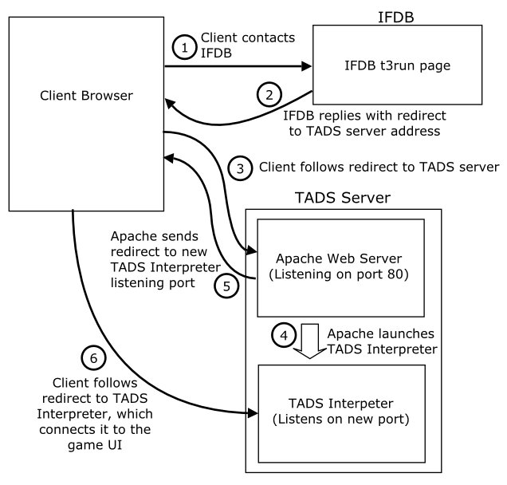

[Table of Contents](toc.htm) \| [Playing on the Web](web.htm) \> Setting
up a custom TADS Web server  
[*Prev:* Deploying your Web UI game](webdeploy.htm)     [*Next:*
Translating and Localizing TADS](local.htm)    

# Setting up a custom TADS Web server

If you have your own Web server machine, and you have some expertise at
setting up Apache Web servers and related software, you can contribute
computing power to the TADS "cloud" by setting up a TADS Web server on
your machine. This chapter explains how.

Note that you **don't** need to set up a TADS server if all you want to
do is deploy your TADS Web UI game. There's an existing public cloud of
servers for any player running any game. To deploy your game, you merely
have to upload it to the IF Archive and create an IFDB page for it. The
[Web deployment chapter](webdeploy.htm) has the details.

The TADS Web Play system is designed to work as a flexible "cloud"
utility service where any number of servers can be added to the network.
Each player is dispatched at game startup to an available server, so
that the CPU load is distributed throughout the network. Servers are
only called upon to contribute CPU power to the network - they don't
have to worry about storing any long-term data, because the games (.t3
files) are downloaded dynamically at start-up, and saved files are
stored on IFDB. This means that each server only has to install a
generic set of software (namely, the TADS interpreter and a basic
Apache/php/MySQL suite); servers don't have to worry about hosting games
or user files. Running a TADS server doesn't require a lot of disk
space.

If you prefer, you can use SQLite instead of MySQL as the database
engine. SQLite is smaller in terms of memory footprint and CPU load, so
it might be preferable if you're using a low-cost VPS, where memory and
CPU time are rationed.

If you don't already run your own Web server, but you're still
interested in contributing to the TADS server cloud, look into getting a
VPS (Virtual Private Server) from a commercial Web hosting service. Lots
of hosting companies offer VPS plans, and they can be quite cheap if you
shop around - as of this writing, it's easy to find one for under \$10 a
month with enough horsepower for TADS Web serving.

## Requirements

**TADS Interpreter**: You'll obviously need a TADS interpreter that has
the full networking functionality, so your server will have to run a
supported operating system, such as Windows or Linux.

**Root/administrator access:** You'll generally need full administrator
(root) access to your machine, since you'll have to configure the
regular Web server on the machine (e.g., Apache) and install the TADS
interpreter software. (This usually rules out "shared hosting" plans
with Web hosts. A VPS or dedicated server is recommended.)

**Static, public network address:** In order to act as a server on the
public Internet, your machine must have a network address that's static
(that is, permanently assigned to your machine) and public (visible on
the Internet, not just on a local subnet). This can be a static numeric
IP address, or a registered domain name.

If your machine is on a home network with a broadband router, it
probably uses a private subnet address, such as a 192.168.x.x address;
and if you have home broadband service through a phone or cable company,
you probably have a dynamic public IP address for your router that
changes from time to time. It's possible to work around both of these
conditions; there are services that let you assign a DNS name to a
dynamic IP address, for example, and some broadband routers have
advanced configuration settings for exposing servers. The details are
beyond the scope of this chapter, so you'll need the relevant expertise
if you want to attempt this type of configuration.

**(L)AMP:** The TADS server package is based on the popular free
software stack known as "LAMP" - Linux, Apache, MySQL (or SQLite), php.
TADS runs on Linux as well as other operating systems, so the actual
required stack is just the "AMP" part. The instructions below assume
you're using an Apache server with php and MySQL or SQLite installed,
but leave the choice of operating system up to you.

## Step-by-step instructions

### Install the TADS Interpreter

The first step is to install a TADS interpreter. For Linux, install
FrobTADS. Build and install exactly as you would for local play.

### Install Apache, MySQL/SQLite, and php

Some Linux distros come with the LAMP components pre-installed, so you
might not need to install anything manually. If your Linux doesn't
include LAMP out of the box, you should be able to use your system's
package manager to install them from the command shell. The command
syntax varies by Linux variety, so you'll have to consult your system's
manuals for specific instructions.

For more information about the specific components, here's where to go:

- MySQL: [www.mysql.com](http://www.mysql.com). MySQL is available in
  free (open source) and commercial versions. The free version is called
  the Community Edition, which you can download from the mysql site.
- SQLite: [www.sqlite.org](http://www.sqlite.org). This is a lightweight
  database engine that you can use instead of MySQL, if you prefer. If
  you're using a low-cost VPS, SQLite might be preferable because it
  uses less memory than MySQL.
- Apache: [www.apache.org](http://www.apache.org). The Apache site
  encompasses a huge suite of projects beyond the basic Web server, and
  the site isn't the easiest to navigate. It might be quicker to do a
  generic Web search for something along the lines of "install apache on
  ubuntu".
- php: [www.php.net](http://www.php.net). Note that some Apache
  distributions include php, so you might not have to install php
  separately if you install Apache first.

### Configure Apache

Follow the instructions in your Apache distribution to set up the basic
Web server. The t3launch scripts don't have any special configuration
requirements for Apache and should work with a typical default
installation.

Here are the key things to check in your Apache configuration file
(usually called httpd.conf or apache2.conf):

- Ensure that .php files are processed as php scripts. This is usually
  the default, but if it's not, you might have to add a directive like
  this to the Apache configuration:
      <FilesMatch "\.php$">
         SetHandler application/x-httpd-php
      </FilesMatch>
- Ensure that .htaccess files can override allow/deny settings. This
  might require adding AllowOverride All in the section for the
  directory tree where you're placing the TADS php files.

### Install the t3launch scripts

Download the t3launch.zip package from
[www.tads.org](http://www.tads.org). Install as follows:

- Unzip the contents of t3launch.zip into a private directory (not part
  of the Web server's document tree)
- Move the t3launch subdirectory and all of its contents to your Apache
  document root directory (as listed in the Apache httpd.conf file under
  the DocumentRoot variable)

### Configure your database

The t3launch scripts need a database engine to manage a local "cache" of
.t3 files downloaded from other servers. The .t3 files that your server
runs will generally be hosted on another server, such as the IF Archive
([www.ifarchive.org](http://www.ifarchive.org)). When a player starts a
game, your server has to transfer the .t3 file from the hosting site to
your server's local disk, via an HTTP GET, so that the TADS interpreter
can load it. If the file has been transfered previously, though,
t3launch simply re-uses the existing local copy; it uses a MySQL table
to keep track of this.

You can use either MySQL or SQLite as the database engine.

**MySQL:** Set up a t3launch database and user account on your MySQL
database. You can do this by entering the following commands using the
mysql command-line tool:

- create user t3launch identified by 'password';
- create database t3launch;
- use t3launch;
- grant all on t3launch.\* to t3launch;

You can substitute different values for the user name, password, and
database name. Use the names you choose here for the DB_USERNAME,
DB_PASSWORD, and DB_SCHEMA parameters in the configuration file setup
below.

**SQLite:** SQLite uses a binary file to store its database tables.
You'll have to choose a directory where this file will be stored. The
directory must be readable and writable by the Web server process, which
typically runs as user "nobody".

The following commands (entered at the Unix command line) will configure
the directory permissions and create an empty file for the database. Log
in as root (or use "su root") to run these commands.

- mkdir /home/db
- chown nobody.nobody /home/db
- touch /home/db/t3launch.db

You can substitute a different directory and/or database file name of
your choosing. Use the file name and location you choose here for the
DB_FILE parameter in the configuration file setup below.

### Configure the t3launch scripts

The t3launch scripts need to be customized for your machine's specific
configuration. The configuration variables are in the file
**t3launch/inc/config.php** within your Apache Document Root directory.
Edit this file, and adjust the following variables as needed:

- DB_ENGINE - set this to "mysql" if you're using MySQL as the database
  engine, or "sqlite" if you're using SQLite
- DB_HOST (MySQL only) - "localhost" by default; if you're running MySQL
  on a separate server machine, set this to the host name of that server
  on your network
- DB_SCHEMA (MySQL only) - the name of the MySQL database you created in
  the database configuration step above
- DB_USERNAME (MySQL only) - the name of the MySQL account you created
  in the database configuration step
- DB_PASSWORD (MySQL only) - the password you selected for your t3launch
  database user
- DB_FILE (SQLite only) - the SQLite database file name you selected in
  the database configuration step above; use the full, absolute path
  (e.g., on Unix, the full path starting with "/")
- T3RUN_EXE - the TADS interpreter executable file; use a full, absolute
  path (e.g., on Unix, use the full path starting with "/")
- T3RUN_OPTS, T3RUN_OPT_WEBHOST, T3RUN_OPT_WEBSIB - if you're running on
  Windows or using FrobTADS on Linux, simply uncomment the appropriate
  set of **define** statements and comment the others. If you're using a
  different platform, you'll have to determine the appropriate option
  syntax for your TADS Interpreter version
- T3RUN_OPT_WEBHOST_NAME - the host name of the server where the game
  will be running; this is normally the same server that's running the
  launch script, which is what the default setting
  \$\_SERVER\['SERVER_NAME'\] yields
- IFDB_ROOT - the default "http://ifdb.tads.org" should be appropriate
  for all installations
- T3_CACHE_DIR - the directory where downloaded .t3 files will be
  stored; use a full, absolute path, and end the path with a "/"
- T3_CACHE_MAX - the maximum size in bytes for the cache directory; when
  adding a new file would push the total used space over this limit, the
  least recently used file(s) in the cache will be deleted to get the
  space usage back under the limit

### Tweak your Linux configuration

This step is optional. If you're running a Linux server, and you have
root access, you can improve TADS server performance by adding the
following line to the file /etc/sysctl.conf:

    echo "0" > /proc/sys/net/ipv4/tcp_slow_start_after_idle

You'll need root privileges to edit that file, so use "su root", or log
in as root to start with. Changes to /etc/sysctl.conf don't take effect
until you reboot the server, but you can put this change into effect
immediately simply by running the command above as a shell command;
again, you'll need root privileges. If you're running on a shared server
and you don't have root access, you can skip this step, since it's only
a performance optimization.

### Test your configuration

First, check that your launch script starts up properly, by opening a
Web browser and typing this in the address bar:

    http://address/t3launch/t3launch.php?ping

Replace *address* with your server's numeric IP address (or, if your
server has a DNS name, you can use the domain name). If it's working
correctly, you'll see a simple text page saying "OK". If that's not what
appears, something's wrong with your configuration.

Next, check that your Apache server is correctly denying Web access to
the supporting scripts in the "inc" directory, by trying this URL in
your browser:

    http://address/t3launch/inc/config.php

Again, use your actual IP or domain in place of *address*. The result
should be a "403 - Forbidden" error. If you *don't* get the 403 error,
something's wrong. This is important for your site's security, because
the "inc" scripts contain private configuration information, such as
your MySQL password. If you see php source code when you request that
address, make sure that your Apache configuration file allows .htaccess
overrides in the "inc" folder.

### Register your server with IFDB

To participate in the IFDB switchboard system (which dispatches players
to your server) and the IFDB storage server (which provides centralized
"cloud" storage for saved games), you must register your server with
IFDB. The process for this isn't currently formalized or automated,
since we don't expect a huge number of servers. Simply send email to the
IFDB administrators (see the [IFDB contact
information](http://ifdb.tads.org/contact)) with the following:

- your name and contact information
- the domain name of your server
- the full URL path to the t3launch.php script you installed above
- your server configuration - operating system, CPU, available memory
  (this helps estimate how many sessions your server can handle at once,
  so that the switchboard can distribute load more evenly across
  servers)

IFDB will assign your server a **server ID** and **storage API key**.
You'll need this information in the next step.

Note that your storage API key is essentially a password, authenticating
your server to the storage server for file transactions. You should keep
this private; for example, be careful not to store it in a file that's
accessible via your Apache server. The API key is a security measure to
limit access to the storage server to recognized game servers, to help
protect user files against unauthorized access.

### Create a tadsweb.config file

Create a file called tadsweb.config in the directory containing your
TADS interpreter program file. This is a simple text file; edit it with
Notepad, emacs, vi, or any other text editor of your choice. Enter the
following information, one variable per line:

- serverid = *server ID assigned by IFDB*
- storage.domain = storage.tads.org
- storage.rootpath = /
- storage.apikey = *storage API key assigned by IFDB*
- watchdog = yes *or* no

The server ID and storage API key are the values you receive when you
register your server with IFDB. If you're setting up a private server
that's not meant to be part of the TADS cloud, you can omit the server
ID and storage server entries.

The "watchdog" setting is described further below.

### The watchdog

The interpreter has a self-monitoring feature called the watchdog. The
watchdog looks for potential problems with the bytecode program's
behavior, and terminates the program if it appears to be misbehaving.
You can turn this setting on or off in your tadsweb.config file.
Currently, the watchdog is implemented only on Unix and Linux platforms;
the configuration setting is ignored on other systems.

The watchdog looks for these conditions:

- High CPU usage: if the program uses more than 40% of CPU time over the
  course of about a minute, the watchdog terminates the program. High
  CPU usage for an extended period often means that the program is stuck
  in a loop, so allowing it to continue running would bring the server
  to a crawl for other users. The watchdog can't distinguish between a
  program that's stuck in a loop and one that's intentionally doing
  heavy-duty number-crunching, but it really doesn't matter: an
  intentionally CPU-intensive program isn't appropriate for a shared
  server either, since it's unfair to other users to bog down the server
  with a compute-intensive task.
  A program that has short bursts of heavy-duty computation from time to
  time won't trigger the watchdog. The program has to use high CPU
  continuously for about a minute to trigger this condition; using 100%
  of CPU for a few seconds at a time will average out to safe levels
  over the course of any given minute, even if repeated frequently.

- Network inactivity: if the program doesn't have any network client
  activity over the course of about six minutes, the watchdog terminates
  it. Shared TADS servers are meant for interactive game sessions, so
  when there a program's network clients have all disconnected, it's
  expected to shut itself down. The standard TADS Web UI library has its
  own activity monitor that normally takes care of this, but we can't
  count on everyone to use the standard library or for every program to
  be bug-free, so the watchdog serves as a backup here. Some programs
  might even intentionally keep running without clients, so that they're
  always on stand-by for incoming connections, the same way that regular
  Web servers run. However, that sort of application isn't appropriate
  for a shared TADS server, since it consumes memory and other resources
  that could be given to an actual interactive user rather than set
  aside for possible future requests. So the watchdog doesn't care
  whether a program is running without clients intentionally or
  inadvertently; in either case, we want to terminate the program.

  It's network activity that matters, not user activity. The watchdog
  won't terminate a standard Web UI program just because the user hasn't
  typed a command in a while. As long as the game session is still open
  in the user's browser, the server will consider the network connection
  to be active. The user doesn't have to type anything or otherwise
  interact with the game; it's enough for the browser window to stay
  open. The javascript program on the client side and the server program
  automatically exchange messages periodically just to let each other
  know that everything's still fine; these background exchanges are
  enough to keep the watchdog happy.

If you plan to include your server in the TADS cloud, or you're
otherwise going to allow people to run arbitrary third-party .t3
programs, you should enable the watchdog. The watchdog is designed to
minimize your server administration work by automatically detecting and
killing buggy programs that you'd otherwise have to kill manually, such
as programs stuck in infinite loops and programs that don't know when to
quit.

If you're setting up a server to run just your own TADS programs, and
you're not allowing third-party programs, you might or might not want to
enable the watchdog. The watchdog is less important when you're running
a known set of programs, since you can test the programs you're hosting
to make sure they don't have any of the bugs that the watchdog would
catch. Of course, bugs can be fiendishly clever at slipping through
testing, so you might still want the watchdog as a backup. On the other
hand, you might specifically not want the watchdog if your programs
intentionally do some of the things that the watchdog targets, such as
heavy number-crunching or running without a client. Those are perfectly
legitimate application behaviors; the watchdog only targets them because
they're inappropriate for a shared, public server. If you're hosting
your own programs on your own private server, you're of course free to
number-crunch with abandon, or to host a Web server (or other continuous
network service) written with TADS. Turning off the watchdog will allow
such applications to run without interference.

## How the launch process works

For those interested, here are the details of how the different machines
and components interact. You might find this helpful if you're trying to
write a non-LAMP replacement for the launch page.

There are three separate machines involved in playing a server-based
TADS game:

- The player's machine, running a Web browser
- IFDB, which serves as a switchboard to dispatch new player connections
  to available TADS servers, and which provides the "cloud" storage for
  saved game files
- Your server machine, where TADS runs

We're only concerned here with that last item, the TADS server. The
client is just a PC (or phone, pad, etc) with a browser; IFDB is managed
by its own administrators, so we don't have to worry about that.

On the TADS server machine, there are two main bits of software you have
to install. The first is the TADS interpreter; the second is a
conventional Web server, generally an Apache server with MySQL and php,
as outlined above.

When a player decides to start a game session, they click on a link in
their browser. That link might come from the game's IFDB page or from
the game author's Web site; that's not really important, though, since
all that matters is that they reach the "t3run" page on IFDB. This is
the IFDB switchboard for the game. It looks through its list of
available game servers - a list that will include your server, once you
register it - and selects one to handle the new session. It then sends
the client an HTTP redirect with the Internet address of the selected
server. Let's assume that your server is the one selected.

The browser follows this redirect to your server. At this point, your
server is just sitting there idling, awaiting new connections. The TADS
interpreter isn't running at all yet. So how does the server even know
about new connection requests? This is where your Apache Web server
comes in. Apache's job is to continually monitor port 80 - the standard
port for Web servers - waiting for someone to send in an HTTP request.
When the player's browser follows the redirect instructions from IFDB to
your machine, what it's really doing is sending an HTTP request to port
80 on your machine. Apache receives this request and handles it.

Apache's response to the HTTP request from the client is to execute a
php program that's part of the TADS server package, called t3launch.php.
This program creates a new TADS process on the server machine, passing
parameters to the new process that tell it which game (.t3 file) to run.
The interpreter loads the .t3 file. Assuming that the .t3 file is a Web
UI game, the game will set up its own internal Web server. This server
opens a new network listener port - not port 80, which is already taken
by Apache, but simply an arbitrary port number that's not being used by
someone else, as assigned by the operating system. TADS relays this
information back to the t3launch program. t3launch in turn relays it
back to the client browser, in the form of another HTTP redirect. This
new redirect tells the browser how to connect to the game's internal Web
server on its newly created port number.

The client browser follows the new redirect, which connects it to the
game's internal Web server. The game takes it from here; the Apache
server's job is done for now, and it simply goes back to monitoring port
80 for new connection requests.

Here's a diagram showing the various steps. Note that the TADS
Interpreter process doesn't exist initially - it doesn't exist until
step 4, where Apache launches it.

------------------------------------------------------------------------

*TADS 3 System Manual*  
[Table of Contents](toc.htm) \| [Playing on the Web](web.htm) \> Setting
up a custom TADS Web server  
[*Prev:* Deploying your Web UI game](webdeploy.htm)     [*Next:*
Translating and Localizing TADS](local.htm)    
