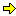
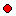

Help Topics \> [Table of Contents](wbcont.htm)  
  

  

# The TADS 3 Debugger

  
  

## Overview

  
  

TADS Workbench features an integrated source-level debugger that can
help you get program code working and track down problems as you develop
your game. A "debugger" is a tool that lets you look into the innards of
your program as it runs - it's sort of an X-ray machine for the
computer. A "source-level" debugger works directly with your original
source code, rather than with the lower-level machine language that's
actually running inside the computer. Using the TADS debugger, you can
walk through your program line by line, watching the values of variables
and object properties as they change at each step. You can also set
conditions that you want to catch, then let your program run at full
speed until one of the conditions pops up, so that you can quickly
figure out exactly when and why something is happening.

Workbench's debugger is built in, so you don't have to run a separate
program to use it. Whenever you run your game from within Workbench,
you're automatically activating the debugger. This lets you stay within
Workbench for practically every part of the development cycle - you can
use Workbench to create your source code, add to it and modify it,
compile your program, test it, and inspect it with the debugger.

There are three key concepts in debugging: stepping through code,
examining variables, and setting breakpoints. We'll discuss each of
these below.  
  

### Stepping through code

The most basic debugging tool is the ability to step through your game's
programming code line by line. This is important because it lets you see
exactly how control flows through your program.

Computer programs are essentially step-by-step recipes - do this first,
then do that, then do this other thing. At any given time, the computer
can only do one thing.\* When something goes wrong, it's helpful to keep
that in mind. Inexperienced programmers sometimes look at all the
different parts of a program and panic, thinking that fifty things must
all be happening at once and it's just impossible to sort out all the
possible interactions. But you don't have to worry about that; in fact,
the computer just does one thing at a time. When you're having trouble
figuring out how the program gets from point A to point B, the solution
is often to step through the code line by line, so that you can see
exactly what the program does at each step and why.

> \*Some languages allow "multi-threaded" programming, meaning that the
> computer can appear to be doing more than one thing at a time. If you
> want to get technical about it, in a single-CPU system, a
> multi-threaded program only *appears* to be doing more than one thing
> at a time; in fact, only one thread is actually running at any given
> time, but the operating system switches back and forth among threads
> so rapidly that it appears to a human observer that the computer is
> doing many things at once. A system with two or more CPUs (or two or
> more "cores," in the case of multi-core processors) can truly run
> multiple threads at once: each CPU or core can simultaneously run a
> separate thread - although even then, each CPU has to do a certain
> amount of waiting at the equivalent of traffic lights to avoid
> conflicting access to memory and other devices. In any case, we're
> ignoring multi-threading of any kind for this discussion, because TADS
> 3 is a single-threaded language. TADS simply doesn't provide a way of
> creating additional threads, so your program will always run as a
> simple step-by-step process.

**Starting the program:** To start the program running, you can do one
of two things:

- First, you can use the Go command (on the Debug menu). This simply
  starts the program running at full speed, *not* stepping through each
  line individually.
- Second, you can use one of the Step commands on the Debug menu - Step
  In, Step Over, or Step Out. These are described more fully below, but
  briefly, they all run one line of code, and then *suspend* the
  program - the debugger freezes the program, remembering everything
  that's going on, so that you can look at the current program state and
  decide what to do next.

**The current line:** At any given time while the program is running,
there's a "current line." The debugger shows you the current line with a
little yellow arrow in the margin of a source file:

The line where the arrow appears is the current line. This is the *next*
line that will be executed when you resume execution or continue
stepping. So, any time you see the little yellow arrow, you know that
the program hasn't yet executed that line - it's about to, as soon as
you "unfreeze" the program.

If you've opened up some other files, and you're not sure where the
current line is, you can easily find the current line using the Show
Next Line command on the Debug menu. This will show the window
containing the current line, and scroll the window so that the yellow
arrow is in view.

You can *move* the current line to a different point in the same
function or method. You can do this by dragging the yellow arrow to a
different line, or by right-clicking on the destination line and
selecting Set Next Statement from the pop-up menu. Moving the current
line in this manner doesn't execute any code in your game - it simply
changes the interpreter's notion of the next line, so that when you
resume execution or step through another line, execution will resume
from the new current line. You're not allowed to move the current line
outside of the current function or method - you can only move it to
another point within the same function. You can only move the current
line to the start of a valid, executable line of code; the debugger
won't let you move it to the middle of a comment, for example, or to the
middle of a statement that's split up across several lines in the source
file.

**Stepping line by line:** Once you're stopped at a current line, the
TADS debugger provides several "Step" commands - these let you step
through code line by line. Each Step command executes the current line,
then suspends execution at the next line. What consistutes the "next
line" depends on which Step command you use. All of the Step commands
are on the Debug menu. These commands are:

**Step Into:** This command executes the current line, and then stops at
whatever line is next, whether that line is in the same function/method
or in a new function or method that the current line calls. This command
is called "Step Into" because it walks into function or method calls.
This command is useful when you want to see the full details of what
happens within each subroutine that the current line calls.

**Step Over:** This command executes the current line, **plus** every
line of every method and function that the current line calls. The
debugger stops as soon as it reaches another line of the *same function
or method* that contains the current line. This is called "Step Over"
because of the way it skips everything that the current line calls as a
subroutine. This command is useful when you want to get the "big
picture" view of the current method/function, and you want to treat any
subroutines it calls as black boxes that you don't need to open up and
look inside of.

**Step Out:** This command executes as many lines of code as it takes to
reach the *caller* of the current method or function. It's called "Step
Out" because it lets the program run until it exits the current method
or function. This command is especially useful if you've stopped the
program somewhere inside the library, and you want to get back to your
own code - you can Step Out until you're back in something you wrote.
It's also useful if you've reached a point in the current function where
you don't need to see any more details about what it does, and you just
want to get back to the caller and resume single-stepping there.

**Resuming full-speed execution:** Rather than stepping through your
entire program line by line, you can resume execution at full speed at
any time. Just use the Go command on the Debug menu. This will continue
executing the program, starting at the current line.  
  

### Examining variables and other data

The second basic debugging tool is the ability to inspect the program's
data - in a TADS program, this means local variables and object
properties. The TADS debugger provides several tools for examining data
as the program runs.

**The Locals window:** Whenever the program is suspended during
line-by-line execution, the debugger shows you the current values for
all of the local variables currently in scope. These values are
displayed in the Locals window - select Local Variables from the View
menu to bring up the window. This window is automatically updated
whenever a variable's value changes, so it's always current.

The Locals window displays a grid with two columns. In each row, the
left column is the name of a local variable, and the right column shows
the value for the variable.

Some data types are actually collections of other values: lists,
vectors, and objects, for example. When a variable contains one of these
types of values, the Locals window adds a little "+" sign next to the
name of the variable. Click the "+" to expand the full list of
sub-values for the variable. In the case of a list, the left column will
be expanded to show list indices - \[1\], \[2\], \[3\] - and the right
column will show the value in that index slot. Similarly, for an object
reference, the left column will be expanded to show property names, and
the right column will show the value for each property.

The Locals window not only lets you view the values of local variables,
but also lets you change the values. To change a value, click on the
value you want to change. This will put the value in text-editing mode,
so that you can type a new value right over the existing value. Press
Return when you're done, and the debugger will update the variable with
the new value you typed.

**self:** The Locals window can also show you all of the properties of
the `self` object, when execution is suspended within a method. (Within
a function, of course, there's no `self`.) To view the `self`
properties, click the "self" tab at the bottom of the Locals window.
Click the "Locals" tab to switch back to the local variables.

**The Watch window:** In addition to the locals, you can view the value
of any valid expression, by entering it in the Watch window. To open the
Watch window, select Watch Expressions from the View menu.

The Watch window works just like the Locals window, except that rather
than showing the current local variables, the Watch window can show
*any* valid expressions. To enter an expression, just click on the left
column of the blank row at the bottom of the Watch window grid - this
will activate text-editing mode, allowing you to enter an expression to
evaluate. You can type any valid expression - a local variable name, an
`object.property` expression, or even a complex expression such as
`x.length()+1`. Just use the same syntax you would in your game's source
code.

You can enter as many different expressions as you want. Just enter each
expression on a new row in the grid.

Like the Locals window, the Watch window re-evaluates each expression in
its list whenever anything in the program changes, so the values shown
are always up to date.

Note that some expressions might be valid at certain times but not at
other times. For example, an expression that refers to a local variable
is obviously only valid when that local variable is in scope - that is,
when the current line is within a code block that defines a local
variable with that name. If an expression isn't valid at the moment, the
Watch window will simply display an error message rather than a value in
the right column of the expression's row. This is perfectly okay; the
debugger will switch back to displaying a value as soon as the current
line steps into a context where the expression is valid again.

At the bottom of the Watch window, there are several little tabs labeled
"Watch 1", "Watch 2", and so on. These tabs let you organize your
expression list into several "pages." You can view a page by clicking on
a tab. This is handy when you need to pay attention to what's going on
in a couple of different contexts, because it lets you keep the
expressions relevant to each context on its own page, rather than piling
them all up in one giant list.

**"Hovering" evaluation:** Many times, you'll want to see the value of a
particular variable or property - but just for a quick, one-time check,
not for ongoing inspection. So it might be slightly more trouble than
it's worth to type the expression into the Watch window. In such cases,
you can check a value simply by positioning the mouse over the variable
name somewhere in a source code window and waiting a few moments. A
little box (in Windows parlance, a "tool tip") will pop up showing the
value of the variable.

If you select a range of text in a source window (by clicking the mouse
at the start of the range, and moving the mouse while holding down the
button until the mouse is at the end of the range), and then you let the
mouse hover over the selection for a few moments, the debugger will
evaluate the entire selection as an expression. For example, if you
highlight the text `x[1]` and then let the mouse hover for a few moments
over the highlighted text, the debugger will try to evaluate the first
element of the list or vector that's in the local variable `x`.

If you don't select a range of text first, the debugger tries to be
smart about picking the expression to evaluate:

- If you hold the mouse over a parenthesis ("()") or square bracket
  ("\[\]"), the debugger looks for the matching delimiter, and uses the
  whole stretch between (and including) the delimiters as the source
  text to evaluate.
- If the text found with the first rule begins with "\[", *and* the
  preceding character isn't an operator of some kind, the debugger
  extends the expression to include the part before the "\[", using the
  first rule above to figure out its limits. (So, for example, a
  parenthesized expression just before the "\[" will be included in
  whole.) Otherwise, if the character before the result so far is ".",
  the debugger extends the expression to include the part before the
  ".", again using the first rule.
- The second rule is then applied repeatedly as long as there are more
  prefix expressions to include.

The point of the second rule - we call it the "prefix" rule - is that
the "suffix" part of an index expression ("lst\[i\]") or object property
evaluation ("obj.prop") is usually uninteresting on its own - you
usually want to see the result of the entire "lst\[i\]" or "obj.prop"
expression rather than just the "i" or "prop" part. The prefix rule
makes it easy to evaluate the whole expression. In the case of an index
expression, point to either of the brackets, and the debugger will
evaluate the whole "lst\[i\]" expression. In the case of an object
property expression, point to the property name, and the debugger will
evaluate the whole "obj.prop" value.

The nice thing about working "backwards" from the suffix part of this
kind of expression is that you can still easily evaluate the prefix part
on its own, just by pointing to it. The prefix part of these expressions
is often as interesting on its own as the whole expression is. The
prefix rule makes it easy to evaluate the prefix on its own, or the
entire expression with the suffix.

Note that hovering won't do anything if the expression involved has any
sort of side effect. Hovering works for most simple expressions - local
variable names, list indexing, object properties that contain simple
data values rather than methods. However, if the expression involves a
function call, a method call, or an assignment, hovering won't have any
effect (and won't even show a pop-up value). All of these types of
expressions could cause side effects when they're evaluated - a method
could change an object property or display output, for example. It would
be very confusing to have the debugger invoking such side effects based
solely on where the mouse happens to be sitting.

**Quick evaluation:** When hovering doesn't work - because an expression
involves a function or method call, for example - you can still evaluate
the expression without adding it to the Watch list. To do this,
highlight the text in the source window containing the expression, and
select Evaluate from the Debug menu. This will bring up the Evaluate
dialog to show you the value of the expression. You can also bring up
the dialog directly, without selecting any text, and then just type in
whatever expression you'd like to evaluate.

**Local variable evaluation context:** Local variables are usually - but
not always - evaluated in the context of the current line. You can
change the evaluation context so that locals are taken from any caller
of the current function instead - see the section on the [Stack
window](#evalctx) below.  
  

### Breakpoints

The third fundamental degugging tool is the breakpoint - the ability to
tell the debugger where and when to suspend execution.

Step-by-step execution is ideal for many debugging tasks, such as
understanding the exact control flow through a particular method.
However, if you've played around with line-by-line execution already,
you've probably noticed that it can take a lot of steps to get anywhere
in the program - the TADS library in particular has a lot of code to
wade through, and single-stepping through all of it would take an
impossibly long time.

This is where breakpoints come in. You'll almost never need or want to
see the entire program running in slow motion. Rather, you'll typically
want to run at full speed *up to a certain point*, then stop the program
to see exactly what's going on, possibly single-stepping from that
point. Breakpoints let you do this.

There are two main kinds of breakpoints.

**Location breakpoints** let you specify *where* you want to interrupt
execution. A location breakpoint lets you tell the debugger that you
want to suspend execution every time the current line reaches a certain
point in the source code.

You set a location breakpoint by opening the source file to the line
where you want to set the breakpoint and clicking the mouse in the gray
left margin area beside the line. This will put a little red circle in
the margin next to the line:

The red circle means that there's a breakpoint set on the line. From now
on, whenever the program's current execution point reaches that point -
that is, when the intepreter is *about to execute the line* - the
debugger suspends execution, exactly as though you had single-stepped
through the code until reaching the breakpoint.

You can remove a location breakpoint by clicking on the red circle.

Location breakpoints can optionally be **conditional**, meaning that a
breakpoint can be set so that it triggers only when a certain condition
is true. This is useful in cases where a particular line of code is
executed frequently, and you're only interested in examining it closely
under specific conditions. By setting a condition, you can skip all the
unnecessary interruptions, letting the program run at full speed until
the exact set of conditions that you're insterested in arises.

To attach a condition to a breakpoint, first set the breakpoint
normally, then use the Edit Breakpoints command on the Debug menu to
open the Breakpoints dialog. The dialog shows a list of breakpoints,
listing their locations by source file and line number - find the
desired breakpoint in the list, select it with the mouse, then click the
Condition button. This will open another dialog that lets you type a
condition to attach to the breakpoint.

A breakpoint condition is evaluated in the context of the line of source
code where the breakpoint is set, so the condition can refer to local
variables within the code block containing the breakpoint.

**Global breakpoints** are the second kind of breakpoint. A global
breakpoing lets you specify *when* you want to interrupt execution,
rather than having to identify a particular location in the code. A
global breakpoint is an expression that the debugger evaluates
continuously as the program executes. The debugger suspends the program
whenever the expression's value either *changes* or *becomes true*,
depending on how you created the breakpoint.

To set a global breakpoint, select Edit Breakpoints from the Debug menu.
This will bring up the Breakpoints dialog. Click the New Global button,
which will display another dialog that lets you enter a global
breakpoint. In the text box, type the expression you want the debugger
to evaluate as the program runs. Use the radio buttons to select when
you want execution to stop - either whenever the expression evaluates to
"true" (meaning any non-zero integer, or any non-numeric data value
other than `nil`), or whenever the expression's value changes. Click OK
to add the breakpoint.

Global breakpoints are extremely useful in cases where something like an
object property value is changing, but you don't understand where or
when or why. Since there's so much TADS library code, it can often be
next to impossible to guess which code is changing a value on you. In
these cases, you can simply set a global breakpoint on the mysteriously
changing expression, and the debugger will do all the tedious work for
you - you can simply let the program run at full speed, and the debugger
will immediately stop execution as soon as the mystery change occurs.

Note that setting global breakpoints can slow down execution noticeably,
as you'd expect. The debugger has to evaluate any global breakpoint
expressions after executing every line of code, so it's a lot of extra
work for the interpreter. Even so, it's a small price to pay when you
really need it - the alternative is manually stepping through the code
one line at a time and monitoring the expression yourself, which
obviously would slow things down a heck of a lot more.

**Run to cursor:** In addition to explicit breakpoints, you can also use
the Run to Cursor command, on the Debug menu, to tell the debugger to
let execution continue until a certain line. This sets a temporary
breakpoint at the cursor, then resumes execution as though you'd used
the Go command. Execution will continue until it reaches the line where
you had the cursor, *or* until any other breakpoint is encountered.  
  

## The Stack window

The debugger provides another tool window, called the Stack window,
which shows the "call stack" that caused the program to reach the
current point. You can open the Stack window by selecting Call Stack
from the View menu.

Each time the program invokes a function or method, the interpreter
remembers the current location in the code, then jumps to the start of
the newly invoked function or method. When a function or method returns
to its caller, either by reaching the very end of the function or by
encountering a `return` statement, the interpreter looks at its memory
of the calling location and jumps back to that point, thus picking up
where the caller left off.

Function and method calls can be nested to considerable depth - that is,
a method can call another method, which can call a third method, which
can call a fourth, and so on. So the interpreter's memory of who called
whom isn't just a simple variable - the interpreter has to remember a
whole list of calling locations, going back all the way to the first
function. This list of callers is known as a "stack." (The name comes
from the way we the stack is used - it's analogous to a physical pile of
objects, where we stack one thing on top of another. Each time we call a
new function, we put the calling location on the top of the pile. Each
time we return, we simply take the top thing off the pile - since that's
the latest thing we added, it's the current return location. The thing
beneath it is the new top of the pile, which is the current return
location's return location.)

The Stack window shows this call list. It's ordered with the current
code location at the top of the window - the "top of the stack," in
computerese. The next line down is the current return location - this is
the current location's caller, and it's where the execution point will
go when the current function or method returns. The next line down is
the caller's caller, and so on, back to the main program entrypoint
(which is always called `_main()`).

Each line of the stack window shows the name of the function, or of the
`object.property`, at that stack level. After that is the list of
arguments to the function or method, enclosed in parentheses. After the
argument list is something like "+ 2f" - that's a hex number showing the
byte offset of the current execution point within the compiled version
of the function or method. That hex value isn't really directly useful,
since it refers to the compiled T3 VM byte code, which you can't see in
the debugger; but it's there to give you a general idea of how far into
the function the execution point is, and particularly to let you
distinguish one location from another.

The stack window displays a little yellow arrow, just like a source file
does, to show you the current line in the stack. This is always the top
line of the window, because the stack window always shows the current
line at the top.

**Changing the evaluation context:** At any given time, the debugger has
an "evaluation context" - this is the code location where the local
variables in the expression are taken from. By default, the debugger
always reads local variables from the code block containing the current
line. However, it's often useful to be able to go back and look at the
values of the locals in one of the calling functions or methods. You can
do this by double-clicking on any line of the stack window.

When you double-click a line in the stack window, three things will
happen. First, the stack window itself will display a green arrow next
to the selected line:

This indicates that the line is the current "context line," meaning that
any local variables in expressions are taken from the code block
containing this line. The second thing that happens is that the source
code containing the selected line is displayed in the text editor, with
the same green arrow in the margin, showing the actual source location
of the context line. The third thing is that the Locals window
immediately switches to show the local variables from the selected code
block, and any expressions in the Watch window that refer to local
variables are updated to reflect the local variable values at the
context line rather than at the current line.

You can switch the evaluation context back to the current line simply by
double-clicking the top line in the stack window. This will remove the
green arrows, indicating that the current line is the current evaluation
context.

The evaluation context automatically resets to the current line whenever
you step through another line of code, or whenever you use Go to resume
execution.

## Breaking into the debugger

While your game program is running, you can manually interrupt it, so
that you can examine the program state in the debugger. There are
several ways to do this.

First, if you're using the standard TADS library, the game's command
parser will recognize the command DEBUG. Type this into the game, and
the game will execute a call that tells the debugger to interrupt it.

Second, you can use the Break into Debugger command on the Debug menu in
the Workbench window. If the program is awaiting input (via the command
line, or a keystroke or other event), the debugger will send the program
a dummy event, then enter single-step mode to interrupt the program.

Third, if your program appears to be stuck in an infinite loop - that
is, it seems to be running and ignoring all input, so that you can't
even get the Workbench window's attention - you can forcibly interrupt
the program by pressing Ctrl+Break (that is, hold down the Ctrl or
Control key, and press the Break key). This should immediately interrupt
the program and enter the debugger.  
  

## Run-time Error Handling

If your program causes a run-time error in the VM, the debugger will
interrupt execution. The debugger displays an alert box with the error
message, then stops program execution at the location where the error
occurred.

You have two options at this point.

First, you can let the error occur as it would have if you'd been
running the program in the normal interpreter, without using the
debugger. To do this, just use the Go command (or any of the Step
commands). The VM will throw an exception object representing the error,
and will process the exception the same as any other, looking for an
enclosing `catch` block to handle it.

Second, you can retry the operation. To do this, you must *move the
current line*. This tells the debugger that you want to try to manually
correct the problem that caused the error and try again. Note that you
can even retry the operation from the same line - to do this, just move
the execution point to a different line first, then move it back to the
original line.

You might want to retry the operation if you can manually change the
value of a variable to make it valid, for example.  
  
  
  
  

------------------------------------------------------------------------

  
Help Topics \> [Table of Contents](wbcont.htm)  
  
Copyright ©1999, 2007 by Michael J. Roberts.
