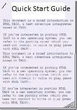
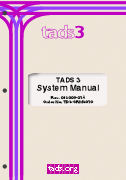

Adv3Lite Bookshelf

# The Books ([Where should I start?](#wherestart))

------------------------------------------------------------------------

[Adv3Lite Quick Start Guide](t3QuickStart.htm)  
by Eric Eve

This brief guide is probably the best place to start for newcomers to
TADS 3 and/or adv3Lite. It contains instructions for installing the
library and compiling a basic game, an explanation of the other
documentation, including guidance on where to go next, and a sample game
newcomers can experiment with if they want to dive straight in.

------------------------------------------------------------------------

[Adv3Lite Tutorial](tutorial/index.htm)  
by Eric Eve

This tutorial introduction is a great starting point for anyone new to
TADS 3 and new to programming. The book opens with the basics of getting
TADS working on your system and setting up your first simple game, so
even if you've never done any programming before, this will help you get
going quickly. The tutorial then leads you step by step through the
design of three example games, showing how to use adv3Lite to implement
the effects needed in the game. By the time you're done, you'll know
your way around the system and you'll be able to write your own games.

------------------------------------------------------------------------

[Learning TADS 3 With Adv3Lite](learning/LearningT3Lite.pdf)  
by Eric Eve

Part tutorial and part reference, *Learning TADS 3 With Adv3Lite* is a
perfect place to start for confident beginners, and for people with a
little more programming experience. This book is designed for learning
TADS on your terms - it's organized by functional area, so once you've
mastered the basics, you can skip around to focus on the areas you're
most interested in. As you develop your game, you can return to the book
as a reference, to review the details of particular TADS features.

*Learning TADS 3 With Adv3Lite* contains a number of exercises. Samples
games suggesting solutions to some of these exercises may be found
[here](learning/exercises.htm). Alternatively you can treat these
solutions as sample code illustrating various aspects of the adv3Lite
library.

------------------------------------------------------------------------

[Adv3Lite Library Manual](manual/index.htm)  
by Eric Eve

This is a comprehensive overview of the adv3Lite library, covering
nearly all of the key classes and functions. It can be used as a
reference by people who are already up and running with the system, or
as a way for users already familiar with TADS 3 to learn about the
adv3Lite library.

------------------------------------------------------------------------

[TADS 3 System Manual](sysman.htm)  
by Michael Roberts

This book is a reference to the TADS 3 language and the T3 VM, including
the standard intrinsic functions and classes. It covers the language and
VM features in depth, so it's the place to go when you need to find the
details on the system.

------------------------------------------------------------------------

[Adv3Lite Library Reference Manual](libref/index.html)

This is an extensively cross-referenced and hyperlinked compilation of
information on the Adv3Lite and system libraries. The entire library is
indexed here, with the latest information generated directly from the
library source code.

------------------------------------------------------------------------

[Introduction to HTML
TADS](http://www.tads.org/t3doc/doc/htmltads/intro.htm)  
by Michael Roberts

TADS 3 uses a variant of HTML as its formatting language. These notes
explain how HTML fits into TADS, and how you can use HTML formatting
codes for text effects, graphics, and sound, and how the TADS variant
differs from standard HTML. (These are essentially just the original
notes for HTML TADS 2, so they're a little rough, but they are updated
with relevant changes for TADS 3. Note that this isn't an HTML
tutorial - but the HTML in TADS is pretty close to standard HTML, so you
can learn it from any of the many tutorials on the Web for ordinary
HTML.)

------------------------------------------------------------------------

# Change Logs

[**Adv3Lite Library Change History**](manual/changelog.htm). A
chronological log of changes to Adv3Lite, the alternative TADS 3
Adventure Framework Library.

------------------------------------------------------------------------

# Notes

These books are copyrighted by their respective authors. In general,
they may be used and distributed without charge, subject to certain
restrictions. Please see the individual books for full copyright and
licensing information.

Some of these books are offered in the "PDF" format. To view PDF files,
you need the Acrobat Reader software, which is available as a [free
download from
Adobe](http://www.adobe.com/products/acrobat/readstep.html).

------------------------------------------------------------------------

# Where do I start with all these manuals?

At first sight, there's a lot of documentation here. If you want some
guidance on where to start, try following the decision tree below (for
each question you reply NO to, go to the next item in the list).

1.  Do you need help installing and setting up TADS 3 and/or adv3Lite?
    IF YES -\> [Quick Start Guide](t3QuickStart.htm)
2.  Are you already familiar with TADS 3? IF YES -\> [Adv3Lite Library
    Manual](manual/index.htm)
3.  Are you familiar with writing Interactive Fiction in another system
    (such as Inform)? IF YES -\> [Learning TADS 3 With
    Adv3Lite](learning/LearningT3Lite.pdf)
4.  Perhaps you should start with the [Adv3Lite
    Tutorial](tutorial/index.htm)
